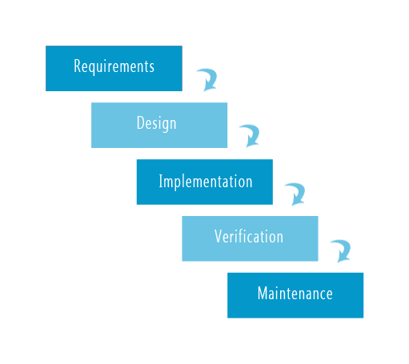
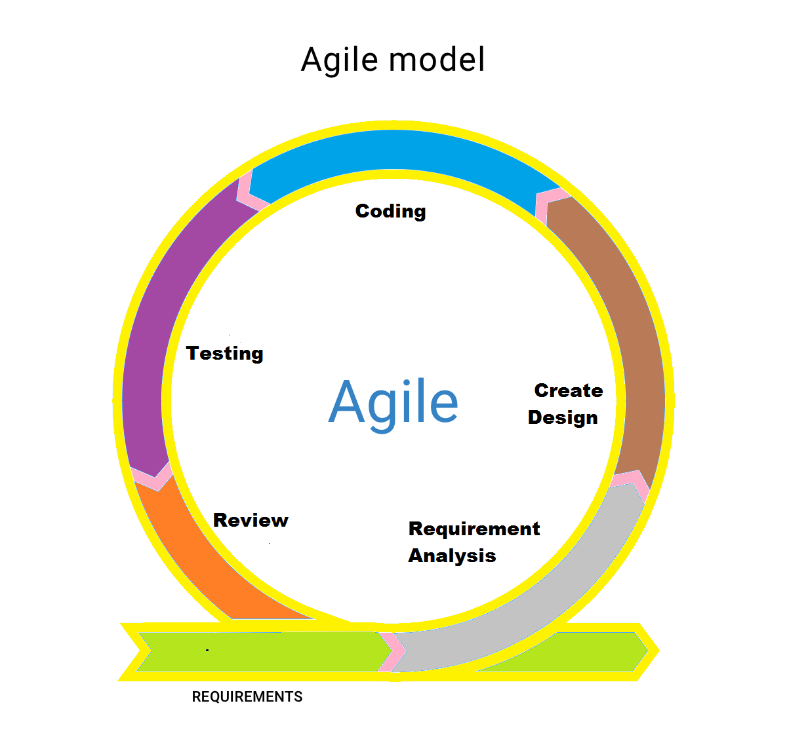

# Application Requirements and Landscape

## SRS (Software Requirements Specifications)

Let’s assume that each of us is an entrepreneur. We are starting a business called Problem Solvers Caffe (PS Caffe). This is a special cafe specifically designed for programmers or problem solvers.

The business has some requirements. These types of requirements are called SRS (Software Requirements Specifications). For this application, the SRS is as follows:

> PS Caffe is an imaginary online coffee delivery service. This business is designed especially for programmers by keeping their lifestyle in mind. We need an application to accept orders online. The application will have the following functional and non-functional requirements.

> **Special Notes:** We are not planning to grow fast. We need an [MVP (Minimal Viable Product)](https://en.wikipedia.org/wiki/Minimum_viable_product) or a Workable Prototype to research our targeted market.

A very simple application. We want to create a coffee delivery service designed for programmers’ lifestyles. Since we are targeting programmers, we need to provide 24/7 service. It is an online service. A special note mentions that we do not aim to scale up the business rapidly. We only want to create an MVP or Workable Prototype for market research. There is a huge difference between an MVP and a real-life application. It's important to note that MVP is not only related to software development but is also used in other fields.

MVP can also be called a Workable Prototype. There are two types of prototypes. One type only shows the UI without any functionality. Our version is a workable prototype. This means we will create an application capable of serving 200/300 people. Therefore, many functionalities will not be necessary for the first version. As the business grows, we will update these features.

Since we are building an MVP and keeping future business growth in mind, we must ensure that our application can be easily transferred to any architecture in the future.

This application has some functional and non-functional requirements. A common interview question is: What is the difference between functional and non-functional requirements?

### Functional Requirements

Functional requirements are requirements that depend on the features of the application. These are usually provided by the client but not always explicitly. For example, a client might mention login functionality but not logout. However, if there is login functionality, there must be logout as well. So, even if the client doesn’t mention it, we need to add some functional requirements ourselves for the application. For this application, the functional requirements are as follows:

> **Functional Requirements (Mostly client requirements):**
>
> - **Local Authentication:** 
>   At the beginning, we don’t want to spend more on authentication services. Just keep it simple by implementing local authentication using email & password. But make sure we can extend local AUTH to OAuth2 anytime in the future. We need the following features:
>   - Hashed password
>   - Email verification
>   - Forget password
>   - Block users if necessary

Initially, we don’t need any paid authentication services. We will only implement local authentication using email and password. However, we need to ensure that this system can be extended to OAuth2 in the future. While creating models or controllers, we must design with this in mind. Additionally, we need features such as hashed passwords, email verification, forget password, and the ability to block any user when required.

> - **Multiple Roles (Role-Based Access Control):**
>   There will be mainly five roles:
>   - Admin: Can create and manage everything, including sales data.
>   - Manager: Can view sales data, inventory, and products but cannot create anything.
>   - Chef: Can only see queue orders.
>   - Delivery Man: Can manage queue orders and change statuses.
>   - User: Cannot view any admin information but can check products, reviews, and place orders.

This application will have five main roles. Admins can access everything. Managers can only view sales data, inventory, and products. Chefs can only view queued orders. Delivery personnel can manage orders and change statuses, such as marking them as "Out for delivery" or "Delivered." Users cannot access admin information but can view products, place orders, and leave reviews.

> - **User will be able to place orders**

Users can place orders as per their preferences.

> - **User will be able to see existing reviews and place reviews only after a successful order**

Users can view existing reviews but cannot place a review until they successfully place and complete an order. Each order allows a single review for that order.

> - **Sales Dashboard**

This will allow viewing sales status, such as how much was sold, whether sales increased or decreased this week, and other data analysis.

> - **Manage Inventory**

This feature will keep track of all inventory items such as sugar, coffee, milk, etc. It can also feature a functionality that subtracts the required amount for an item like cappuccino from the inventory.

> - **Live Tracking of Orders**

Users can live track their orders. For instance, when an order is placed, the status will show as "Order Placed." Similarly, statuses such as "Processing," "Out for Delivery," and "Delivered" will be shown. In the future, based on application growth, Google Maps API can be integrated for live location tracking.

These are the functional requirements.

### Non-Functional Requirements

Non-functional requirements do not depend on application features. These are almost the same for all applications. They ensure how beautifully and safely the application performs. For example, this application has the following non-functional requirements:

> **Non-Functional Requirements:**

> - **Secure**

An application must be secure to prevent unauthorized access.

> - **Reliable**

The application must be reliable so that users can trust it. For example, if a user places a coffee order but finds it missing after 30 minutes while their money has been deducted, they will lose trust. Therefore, data security and consistency are essential.

> - **Easy Maintainability**

As an MVP, this product is designed for public research, so it will undoubtedly have many bugs. Furthermore, users might request additional features over time. To address this, the application should be built in a way that makes it easy to add features and fix bugs.

> - **Awesome Usability**

This is entirely a UX term. If users cannot use the application easily, they won’t use it regardless of its features. Thus, usability must be excellent.

> - **High Availability (Not a main concern for MVP)**

This means the application should be available 24/7. Although this is not a primary concern for the MVP, we might enhance availability based on application growth.

> - **Scalability (Not a main concern for MVP)**

As user numbers grow, the application must scale. While this is not necessary for the MVP, it’s important to consider scalability during development.

These are the non-functional requirements.

## SDLC Models

We typically work with two models for project management: Waterfall Model and Agile Model. Other models exist as well, but these two have been successful for years.

### Waterfall Model

If requirements are fixed and won’t change for 4-5 years, we use the Waterfall Model. This model is effective for long-term projects.

We can understand the topic from the above image. Everything we have done so far is part of the Requirements. Now, after analyzing these requirements, we need to decide which architecture to use, how to architect it, which system design to apply, what challenges might arise, what constraints might be there, how to solve those problems, and how to reduce the time. These topics are part of the Design phase. Then, we proceed with UI/UX, frontend development, backend development, API creation, all of which are part of the Implementation phase. After that, we will go through various types of testing—load testing, acceptance testing, security testing, etc. Once these tests pass, we can deploy our application. All of this falls under the Verification phase.

Once the application is built, there will always be bugs. Debugging and maintenance are part of the Maintenance phase.

There is a major problem with this model. For example, the requirements analysis is complete, and design is finished. 50% of the implementation is done, and now the client requests a change that breaks the entire system. In such a case, we would have to restart everything from scratch, rendering all our previous work useless.

### Agile Model

The problem mentioned above can be avoided with the Agile Model. Now, the question is, what is the Agile Model? The Agile Model is a type of Waterfall Model. In the Waterfall Model, we work for the long term, usually for 2-3 years. On the other hand, the Agile model breaks down the Waterfall Model into 7 or 15-day cycles. In each cycle, there is a specific requirement, and based on that requirement, design, implementation, and verification are done. After the first cycle, the next cycle begins with a new requirement. For example, in the first 15 days, we will work on local authentication. In the next 15 days, we will work on role-based access control, and so on. Now, two months later, if the client says they want to add phone number authentication in addition to email, since we worked on authentication separately, we can just modify the authentication process without affecting the rest of the work. This model allows for modular changes without disrupting the entire system.

Since our application is an MVP, we will blindly choose the Agile Model.

## Choose Necessary Technology

For developing our application, we need to determine which technology is most suitable. To do this, we need an overview, and here is a basic outline to guide you.

First, we need to create the SRS. For this, the following tools can be useful:
- Google Docs, Microsoft Office, Notion
- (To draw UML Diagrams, ER Diagrams, Activity Diagrams, Use case diagrams, etc.) draw.io, Lucid chart

Then, we move to the design part. This is considered the blueprint of any application. In this part, we will cover:

- System Design

    - Architectural Decision

        - Monolithic (Layered)
            - Easy to develop but becomes very complex to maintain as the application grows.
        - Microservice
            - Hard to develop but easy to maintain.
        - Serverless (FAAS - Function as a Service)

        
      A Monolithic Application means all the features of an application will be in one place. On the other hand, Microservices divide the features of the application into separate services and keep them in different servers. Since each service will have a separate database, communication between them can be tricky. Therefore, for a small team or individual developer, Microservices should generally be avoided.
         
      If it’s an MVP, we will go with Monolithic Architecture. For high availability and scalability requirements, Microservices should be used.
        
      Serverless Architecture is used when the client expects rapid growth and scalability, where the application can grow quickly without user-facing issues.
        
    - Select Database
      There are many types of databases in the market. We need to determine which type suits our needs:
        - SQL (when we know exactly what properties the data will have)
            - PostgreSQL
            - MySQL
        - NoSQL (when requirements change randomly)
            - MongoDB
            - Cassandra
        - Key-value
            - Redis (caching, job scheduling, message broker)
            - DynamoDB
        - Graph Database (for graph-structured data)
            - Neo4j
        - Search Database (used for search engine-related tasks)
            - Elastic Database (Open Source - Text Search)
            - Algolia Search (Open AI 3 - NLP)

- Software Architecture
  Software Architecture is directly related to coding. It depends entirely on the system design. For software architecture, we need to know:
    - OOP
    - OOP Design Patterns & Principles
    - DSA
    - Clean Code Architecture
    - Problem Solving

- Testing
    - Test Driven Development (Write tests first, then the main code)
    - E2E (End to End) Testing (Headless browser testing)

- Distribution
    - DevOps (automating operational tasks)
        - Continuous Integration (CI)
            - Git and Github
            - Linux, SSH (Secured Shell)
            - Circle CI, Travis CI, Jenkins (Integration servers)
            - Docker (For Single Service), Docker Compose (For Multiple Services)
            - Docker Swarm, Kubernetes (Managing applications in multiple places)
            - Prometheus, Nagios (Continuous Monitoring)
            - Ansible

    - Cloud Engineering (A cloud platform where we deploy our application)
        - VPC (Virtual Private Cloud)
        - EC2 (Elastic Compute Cloud)
        - S3 (Storage Service)
        - RDS (Relational Database Service)
        - DynamoDB
        - Route 53
        - CloudFront (CDN)
        - SES (Simple Email Service)
        - SNS (Simple Notification Service)
        - SQS (Simple Queue Service)
        - API Gateway
        - Lambda
        - Step Functions
        - CloudWatch
        - CloudFormation, Terraform, CDK (for non-functional requirements)

- Maintenance

## Decision

Based on what we’ve learned, let's now make decisions for our application. Since it’s an MVP, and there’s no need for high availability or scalability, we can skip Cloud Engineering for now. A simple 4/8 GB RAM server should suffice. Initially, DevOps will not be necessary, as we just need a workable prototype. Later, it will be required.

- For the MVP, we will use Monolithic Architecture.
- Since the decision is likely to change randomly, we will use a NoSQL Database (MongoDB Atlas).
- For the backend, we need to answer two questions:
    - Will our application require heavy computation (video/image processing)? If not, we can rule out .NET, Java Spring Boot, and GoLang.
    - Is the application MVC or multi-page? If it is, we can rule out NodeJS.
      Since our application is data-driven, we will go with NodeJS. NodeJS is ideal for data-driven, real-time applications that don’t block requests. We can use frameworks like Hapi, Express, or Fastify.