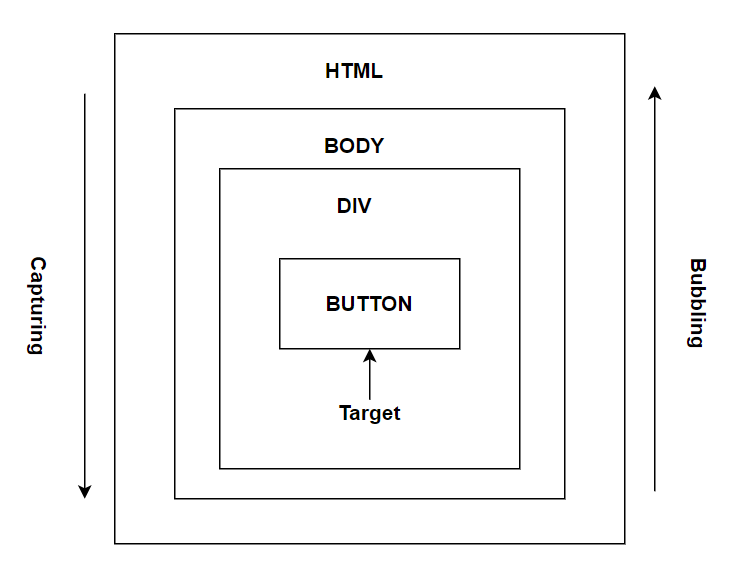

# Browser

## Event phases of a browser
There are 3 phases in the lifecycle of an event propagation in JavaScript,
### Capturing phase
This phase goes down gradually from the top of the DOM tree to the target element when a nested element clicked. Before 
the click event reaching the final destination element, the click event of each parent's element must be triggered.

### Target phase
This is the phase where the event originally occurred reached the target element .

### Bubbling phase
This is reverse of the capturing phase. In this pase, the event bubbles up from the target element through it's parent
element, an ancestor and goes all the way to the global window object.

The pictorial representation of these 3 event phases in DOM looks like below,

### Sources
* [javascript-interview-questions](https://github.com/sudheerj/javascript-interview-questions)