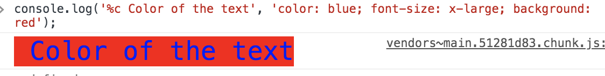

# Object
`Object` is a global object in JavaScript that has methods for creating and manipulating objects. It is a constructor
function that creates an object wrapper for the given value. It can also be used to create new objects.

## Ways of Creating Objects in JavaScript

### Method 1: Function-Based

This method is useful if we want to create several similar objects. In the code sample below, we wrote the function 
`Employee` and used it as a constructor by calling it with the `new` operator.

```javascript
function Employee(fName, lName, age, salary) {
  this.firstName = fName;
  this.lastName = lName;
  this.age = age;
  this.salary = salary;
}

// Creating multiple objects which have similar properties but different values assigned to object properties.
var employee1 = new Employee('John', 'Moto', 24, '5000$');
var employee2 = new Employee('Ryan', 'Jor', 26, '3000$');
var employee3 = new Employee('Andre', 'Salt', 26, '4000$');
```

### Method 2: Function constructor with prototype
This is similar to function constructor, but it uses prototype for their properties and methods.

```js
function Person() {}
Person.prototype.name = "Sudheer";
var object = new Person();
```
This is equivalent to creating an instance with `Object.create` method with a function prototype and then calling that 
function with an instance and parameters as arguments.
```js
function func() {}

new func(x, y, z);
```
or
```js
// Create a new instance using function prototype.
var newInstance = Object.create(func.prototype);

// Call the function
var result = func.call(newInstance, x, y, z);

// If the result is a non-null object then use it otherwise just use the new instance.
console.log(result && typeof result === 'object' ? result : newInstance);
```
### Method 3: Object Literal

Object Literal is the best way to create an object and is used frequently. Below is a code sample for creating an 
employee object that contains properties as well as methods.

```js
var employee = {
  name: 'Nishant',
  salary: 245678,
  getName: function() {
    return this.name;
  }
}
```

The code sample below is a Nested Object Literal, where `address` is an object inside the `employee` object.

```javascript
var employee = {
  name: 'Nishant',
  salary: 245678,
  address: {
    addressLine1: 'BITS Pilani',
    addressLine2: 'Vidya Vihar',
    phoneNumber: {
      workPhone: 7098889765,
      homePhone: 1234567898
    }
  }
}
```

### Method 4: From Object Using `new` Keyword / Object Constructor

In the code below, a sample object has been created using the `Object` constructor function.

```javascript
var employee = new Object(); // Created employee object using new keyword and Object()
employee.name = 'Nishant';
employee.getName = function() {
  return this.name;
}
```
Another way to create an object using the `Object` constructor is by pass an object literal as an argument.

```javascript
var employee = new Object({
  name: 'Nishant',
  salary: 245678,
  getName: function() {
    return this.name;
  }
});
```

Also, `new` is not required when creating an object using `Object` constructor.

```js
var employee = Object();
employee.name = 'Nishant';
employee.salary = 245678;
employee.getName = function() {
  return this.name;
}
console.log(employee) // { name: 'Nishant', salary: 245678, getName: [Function: getName] }
```

```js
var employee = Object({
  name: 'Nishant',
  salary: 245678,
  getName: function() {
    return this.name;
  }
});
console.log(employee) // { name: 'Nishant', salary: 245678, getName: [Function: getName] }
```

### Method 5: Using `Object.create` Method

**`Object.create(obj)` will create a new object and set the `obj` as its prototype**. It’s a modern way to create objects 
that **inherit properties from other objects**. The `Object.create` function does not run the constructor. You can use 
`Object.create(null)` when you don’t want your object to inherit the properties of `Object`.

```javascript
var employee = {
  getName: function() {
    return this.name;
  }
};

var emp1 = Object.create(employee);
employee.name = 'Nishant';
console.log(employee.getName()); // Output: Nishant


emp1.getName = function() {
   console.log('xyz-Anonymous');
};

employee.getName(); //Nishant
emp1.getName();//xyz-Anonymous
```
```js
var employee = {
  name: 'Nishant',
  displayName: function () {
    console.log(this.name);
  }
};

var emp1 = Object.create(employee);
console.log(emp1.displayName());  // output "Nishant"

emp1.displayName = function() {
  console.log('xyz-Anonymous');
};

employee.displayName(); //Nishant
emp1.displayName();//xyz-Anonymous
```

In addition to this, the `Object.create()` method also allows specifying a second argument which is an object containing 
additional properties and methods to add to the new object.

For example:
```javascript
var emp1 = Object.create(employee, {
  name: {
    value: "John"
  }
});

emp1.displayName(); // "John"
employee.displayName(); // "Nishant"
```
In the example above, `emp1` is created with its own value for `name`, so calling `displayName()` method will display 
"John" instead of "Nishant".

Objects created in this manner give you full control over newly created objects. You are free to add or remove any 
properties and methods you want.

The following code creates a new empty object whose prototype is `null`.

```js
var object = Object.create(null);
```

### Method 6: Using `Object.assign()` Method
```js
const orgObject = { company: 'XYZ Corp'};
const carObject = { name: 'Toyota'};
const staff = Object.assign({}, orgObject, carObject);// { company: 'XYZ Corp', name: 'Toyota' }
```

### Method 7: ES6 Classes
```js
class Employee {
  constructor(name, age, salary) {
    this.name = name;
    this.age = age;
    this.salary = salary;
  }
  incrementSalary(byValue) {
    this.salary = this.salary + byValue;
  }
}
```

### Method 8: Using Singleton Pattern
```js
var object = new (function () {
  this.name = "Sudheer";
})();
```

```js
var Singleton = (function () {
  var instance;

  function createInstance() {
    var object = new Object("I am the instance");
    return object;
  }

  return {
    getInstance: function () {
      if (!instance) {
        instance = createInstance();
      }
      return instance;
    }
  };
})();
```

### Object literal vs. Constructor for creating objects
- Literals are global objects in JavaScript. If we want singleton object and will share across the application then we
  can use object literal.
- If we want to create multiple objects, then we can use constructor function as we can create multiple objects using
  constructor function and only one object using object literal.
- For OOP features like inheritance, polymorphism, encapsulation, we can use constructor function, not object literal.


## `Object.keys()`
Returns an array of a given object's own property names, in the same order as we get with a normal loop.
```js
const user = {
  name: "John",
  gender: "male",
  age: 40,
};

console.log(Object.keys(user)); //['name', 'gender', 'age']
```

## Check if a key exits in an object
#### `in` Operator
```js
const user = {
    name: "John"
};

console.log("name" in user); // true
console.log("age" in user); // false
```
#### `hasOwnProperty` Method
```js
const user = {
  name: "John"
};

console.log(user.hasOwnProperty("name")); // true
console.log(user.hasOwnProperty("age")); // false
```
#### `undefined` Comparison
```js
const user = {
  name: "John"
};

console.log(user.name !== undefined); // true
console.log(user.age !== undefined); // false
```
#### `Object.keys` Method
```js
const user = {
  name: "John"
};

console.log(Object.keys(user).includes("name")); // true
console.log(Object.keys(user).includes("age")); // false
```
#### `Object.hasOwn` Method (ES2022)
```js
const user = {
  name: "John"
};

console.log(Object.keys(user).includes("name")); // true
console.log(Object.keys(user).includes("age")); // false
```


## Add a key value pair
* Using dot notation
* Using square bracket notation
```js
var object = {
  key1: value1,
  key2: value2,
};
object.key3 = "value3";
obj["key3"] = "value3";
```
Square bracket notation is useful when the name of the property is dynamically determined, such as when the property 
name is stored in a variable.
```js
var dynamicKey = "key4";
object[dynamicKey] = "value4";
console.log(object);
// Outputs: { key1: "value1", key2: "value2", key3: "value3", key4: "value4" }
```


## Different Ways to Access Object Properties
#### Dot Notation
```js
objectName.property;
```

#### Square Brackets Notation
```js
objectName["property"];
```

#### Expression Notation
```js
objectName[expression];
```


## Check is the object empty
#### Using `Object.entries` (ECMA 7+)
```js
const obj = {};
console.log(Object.entries(obj).length === 0 && obj.constructor === Object); // true
```
#### `Object.keys` (ECMA 5+)
```js
const obj = {};
console.log(Object.keys(obj).length === 0 && obj.constructor === Object); // true
```
#### `for-in` Loop with `hasOwnProperty` (Pre-ECMA 5)
```js
function isEmpty(obj) {
  for (var prop in obj) {
    if (obj.hasOwnProperty(prop)) {
      return false;
    }
  }
  return JSON.stringify(obj) === JSON.stringify({});
}

const obj = {};

console.log(isEmpty(obj)); // true
```


## Delete a key value pair
```js
var obj = {
  key1: "value1",
  key2: "value2",
  key3: "value3"
};

delete obj.key1;
console.log(obj); // { key2: "value2", key3: "value3" }
```


## Merge two objects
```js
const obj1 = { a: 1, b: 2 };
const obj2 = { b: 3, c: 4 };
const obj3 = { ...obj1, ...obj2 };
console.log(obj3); // { a: 1, b: 3, c: 4 }
```

## Copy an object
```js
const obj = { a: 1, b: 2 };
const copy = { ...obj };
console.log(copy); // { a: 1, b: 2 }
```


## Iterate over an object
#### Using `for...in` Loop
```js
const obj = { a: 1, b: 2, c: 3 };

for (const key in obj) {
  console.log(key, obj[key]);
}
```

#### Using `Object.keys()`
```js
const obj = { a: 1, b: 2, c: 3 };

Object.keys(obj).forEach(key => {
  console.log(key, obj[key]);
});
```

#### Using `Object.entries()`
```js
const obj = { a: 1, b: 2, c: 3 };

Object.entries(obj).forEach(([key, value]) => {
  console.log(key, value);
});
```

#### Using `Object.getOwnPropertyNames()`
```js
const obj = { a: 1, b: 2, c: 3 };
    
Object.getOwnPropertyNames(obj).forEach(key => {
  console.log(key, obj[key]);
});
```


## Convert an object to an array
#### Using `Object.entries()`
```js
const obj = { a: 1, b: 2, c: 3 };
const arr = Object.entries(obj);
console.log(arr); // [["a", 1], ["b", 2], ["c", 3]]
```

#### Using `Object.keys()`
```js
const obj = { a: 1, b: 2, c: 3 };
const arr = Object.keys(obj).map(key => [key, obj[key]]);
console.log(arr); // [["a", 1], ["b", 2], ["c", 3]]
```


## Define Multiple Properties
```js
var obj = {};

Object.defineProperties(obj, {
  property1: {
    value: true,
    writable: true
  },
  property2: {
    value: "Hello",
    writable: false
  }
});

console.log(obj.property1); // true
console.log(obj.property2); // Hello
```


## Property Descriptors of an Object
You can use the `Object.getOwnPropertyDescriptors()` method to retrieve all the own property descriptors of a given
object. A property descriptor provides detailed information about a property, such as whether it can be modified, 
whether it is enumerable, and more.

**Example Usage** <br/>
```js
const newObject = {
  a: 1,
  b: 2,
  c: 3,
};

const descriptorsObject = Object.getOwnPropertyDescriptors(newObject);

console.log(descriptorsObject.a.writable); // true
console.log(descriptorsObject.a.configurable); // true
console.log(descriptorsObject.a.enumerable); // true
console.log(descriptorsObject.a.value); // 1
```
In this example, Object.getOwnPropertyDescriptors(newObject) returns an object that contains all the property 
descriptors for newObject. Each property descriptor includes detailed attributes about each property.

#### The attributes provided by a property descriptor
A property descriptor is an object that contains the following attributes:

* `value`: The value associated with the property.
* `writable`: A boolean that determines whether the value associated with the property can be changed.
* `configurable`: A boolean that returns true if the type of this property descriptor can be changed and if the property 
  can be deleted from the corresponding object.
* `enumerable`: A boolean that determines whether the property appears during enumeration of the properties on the
  corresponding object.
* `set`: A function that serves as a setter for the property.
* `get`: A function that serves as a getter for the property.

These attributes provide comprehensive control over the behavior of object properties, enabling advanced manipulation 
and protection of object state.


## Using Constructor Functions for Inheritance in JavaScript

Let's say we have a `Person` class which has `name`, `age`, and `salary` properties, and an `incrementSalary()` method.

```javascript
function Person(name, age, salary) {
  this.name = name;
  this.age = age;
  this.salary = salary;
  this.incrementSalary = function (byValue) {
    this.salary = this.salary + byValue;
  };
}
```

Now we wish to create an `Employee` class which contains all the properties of the `Person` class and wanted to add some 
additional properties to the `Employee` class.

```javascript
function Employee(company){
  this.company = company;
}

// Prototypal Inheritance 
Employee.prototype = new Person("Nishant", 24, 5000);
```

In the example above, `Employee` type inherits from `Person`. It does so by assigning a new instance of `Person` to 
`Employee.prototype`. After that, every instance of `Employee` inherits its properties and methods from `Person`.

```javascript
var emp1 = new Employee("Google");

console.log(emp1 instanceof Person); // true
console.log(emp1 instanceof Employee); // true
```

Let's understand constructor inheritance:

```javascript
// Defined Person class
function Person(name){
  this.name = name || "Nishant";
}

var obj = {};

// obj inherits Person class properties and methods 
Person.call(obj); // constructor inheritance

console.log(obj); // Object {name: "Nishant"}
```

Here we saw calling `Person.call(obj)` defines the `name` property from `Person` to `obj`.

```javascript
console.log(name in obj); // true
```

Type-based inheritance is best used with developer-defined constructor functions rather than natively in JavaScript.
This also allows flexibility in how we create similar types of objects.


## Object Initializer
An object initializer is a comma-separated list of zero or more pairs of property names and associated values of an
object, enclosed in curly braces `{}`. The object initializer syntax is a shorthand for creating objects.

```js
var initObject = { a: "John", b: 50, c: {} };

console.log(initObject.a); // Output: John
```
In this example, initObject is created with three properties: a, b, and c. The property a has the value "John", b has 
the value 50, and c is an empty object.


## Option Chaining
According to MDN official docs, the optional chaining operator (?.) permits reading the value of a property located deep
within a chain of connected objects without having to expressly validate that each reference in the chain is valid.

The `?.` operator is like the `.` chaining operator, except that instead of causing an error if a reference is nullish 
(null or undefined), the expression short-circuits with a return value of undefined. When used with function calls, it 
returns undefined if the given function does not exist.

```js
const adventurer = {
  name: "Alice",
  cat: {
    name: "Dinah",
  },
};

const dogName = adventurer.dog?.name;
console.log(dogName);
// expected output: undefined

console.log(adventurer.someNonExistentMethod?.());
// expected output: undefined
```


# Prototype


### Some Object Does not Have prototypes
In JavaScript, not all objects have prototypes. Specifically, there are two cases where an object does not have a 
prototype:

#### The Base Object (Object.prototype)
This is the root of the prototype chain for all standard objects in JavaScript. The prototype of `Object.prototype` is 
`null`, meaning it does not inherit from any other object.

#### Objects Created with `Object.create(null)`
When an object is created using `Object.create(null)`, it is created without a prototype. This means that such an object 
does not inherit from `Object.prototype` and therefore does not have access to methods like `toString()`, 
`hasOwnProperty()`, etc.

```js
// Creating an object with Object.create(null)
let obj = Object.create(null);

console.log(Object.getPrototypeOf(obj)); // null
console.log(obj.toString); // undefined (no inherited methods)

// The base object
console.log(Object.getPrototypeOf(Object.prototype)); // null
```


## Prototype Chain
The prototype chain is a series of objects linked together through their prototype properties. When you access a
property or method on an object, JavaScript will first look for it on the object itself. If it doesn't find it, it will 
look at the object's prototype, and so on, until it reaches the end of the chain.

The prototype on object instance is available through `Object.getPrototypeOf(object)` or `__proto__ property` whereas 
prototype on constructor function is available through `Object.prototype`.


## Getting the Prototype of an Object
You can use the `Object.getPrototypeOf(obj)` method to return the prototype (i.e., the internal `[[Prototype]]`
property) of a specified object. If the object does not inherit properties from any other object, it will return `null`.
```js
const newPrototype = {};
const newObject = Object.create(newPrototype);

console.log(Object.getPrototypeOf(newObject) === newPrototype); // true
```

### Behavior with String Type in `getPrototypeOf`
**ES5** <br/>
If you pass a string to Object.getPrototypeOf(), it throws a TypeError because strings are not objects.
```js
Object.getPrototypeOf("James"); // TypeError: "James" is not an object
```

**ES6** <br/>
The string is coerced to an object, and String.prototype is returned.
```js
Object.getPrototypeOf("James"); // String.prototype
```
### Setting the Prototype of an Object
You can use the `Object.setPrototypeOf()` method to set the prototype of a specified object to another object or `null`.
```js
Object.setPrototypeOf(Square.prototype, Rectangle.prototype);
Object.setPrototypeOf({}, null);
```

##  Prototype Property
The `prototype` property is used to add new properties and methods to an object constructor. It allows you to define 
properties and methods that will be shared by all instances of the object. When you create a new object using the 
constructor, the new object will inherit the properties and methods defined in the prototype.

```javascript
function Person(name, age) {
  this.name = name;
  this.age = age;
}
```
In the example above, the `Person` function is used as a constructor to create new `Person` objects. If you want to add 
a new method to all `Person` objects, you can do so by adding the method to the `Person.prototype` object.

```javascript
Person.prototype.greet = function() {
  return `Hello, my name is ${this.name} and I am ${this.age} years old.`;
};
```
The `greet` method is added to the `Person.prototype` object, which means that all `Person` objects will have access to 
this method.

```javascript
const john = new Person('John', 30);
console.log(john.greet()); // Output: Hello, my name is John and I am 30 years old.
```
When you create a new `Person` object using the `Person` constructor, the `greet` method is available on the new object.

### Differences between `prototype` and `__proto__` in JavaScript


## Property
In JavaScript, objects can have properties that are either their own properties or inherited from their prototype.

### Own Property
An own property is a property that is directly defined on an object itself. It is not inherited from the object's prototype.

```javascript
var person = {
  name: 'John'
};
person.age = 30;

console.log(person.name); // John (own property)
console.log(person.age);  // 30 (own property)
```

### Prototype Property
The `prototype` property is used to add new properties and methods to an object constructor. It allows you to define
properties and methods that will be shared by all instances of the object. When you create a new object using the
constructor, the new object will inherit the properties and methods defined in the prototype.

```js
function Person(name, age) {
  this.name = name;
  this.age = age;
}
```
In the example above, the `Person` function is used as a constructor to create new `Person` objects. If you want to add
a new method to all `Person` objects, you can do so by adding the method to the `Person.prototype` object.

```js
Person.prototype.greet = function() {
  return `Hello, my name is ${this.name} and I am ${this.age} years old.`;
};
```
The `greet` method is added to the `Person.prototype` object, which means that all `Person` objects will have access to
this method.

```js
const john = new Person('John', 30);
console.log(john.name) // Own property Output: John
console.log(john.greet()); // Function definition (inherited from prototype) Output: Hello, my name is John and I am 30 years old.
```
When you create a new `Person` object using the `Person` constructor, the `greet` method is available on the new object.

We can also define prototype properties and methods for built-in objects like `Array`, `String`, `Number`, etc.

```js
Array.prototype.sum = function() {
  return this.reduce((acc, val) => acc + val, 0);
};
```
This will add a `sum` method to all arrays in JavaScript.

```js
const numbers = [1, 2, 3, 4, 5];
console.log(numbers.sum()); // Output: 15
```

**Also, we can define prototype properties using `Object.create({})` method.**

Here, `person` object inherits properties `name` and `age` from the object passed to `Object.create()`. So, `name` and
`age` are prototype properties of `person`.

```js
let person = Object.create({
  name: "Nishant",
  age: 24
});

console.log(person.name); // Output: Nishant
console.log(person.age);  // Output: 24
console.log(person.hasOwnProperty('name')); // Output: false
console.log(person.hasOwnProperty('age'));  // Output: false
console.log(Object.keys(person)); // Output: []


//defining own property same as prototype property
person.name = "John";
console.log(person.name); // Output: John
console.log(person.hasOwnProperty('name')); // Output: true

//if we try to delete then it will first delete own property
delete person.name;
console.log(person.name); // Output: Nishant

//if we try to delete again then it will not delete prototype property
delete person.name;
console.log(person.name); // Output: Nishant
```

### Differences between Own Properties and Prototype Properties
* Definition Location:
    * **Own Properties:** Defined directly on the object.
    *  **Prototype Properties:** Defined on the prototype of the object.
* Inheritance:
    * **Own Properties:** Not inherited by other objects.
    * **Prototype Properties:** Inherited by other objects of the same type.
* Ownership:
    * **Own Properties:** Belong to the object itself.
    * **Prototype Properties:** Belong to the object's prototype.
* Visibility:
    * **Own Properties:** Visible when iterating over the object's properties using methods like `Object.keys()` or 
    `for...in` loop.
    * **Prototype Properties:** Not visible when using `Object.keys()`, but visible in `for...in` loop.
* Access:
    * **Own Properties:** Accessed directly on the object.
    * **Prototype Properties:** Accessed through the object's prototype chain.
* Modifiability:
    * **Own Properties:** Can be modified directly on the object.
    * **Prototype Properties:** Can be modified on the prototype, affecting all objects of the same type.
* Deletion:
    * **Own Properties:** Can be deleted directly on the object using the `delete` operator.
    * **Prototype Properties:** Cannot be deleted directly on the object.
* Performance:
    * **Own Properties:** Faster to access than prototype properties.
    * **Prototype Properties:** Slower to access than own properties.
* Memory Usage:
    * **Own Properties:** Use more memory than prototype properties.
    * **Prototype Properties:** Shared among all objects of the same type, reducing memory usage.
* Clarity:
    * **Own Properties:** Clearly defined on the object.
    * **Prototype Properties:** May not be immediately visible when reading the object's definition.
* Use Cases:
    * **Own Properties:** For object-specific data that should not be shared.
    * **Prototype Properties:** For shared data and methods that should be inherited by all objects of the same type.
* Best Practices:
    * **Own Properties:** Use for unique data that varies between objects.
    * **Prototype Properties:** Use for shared data and methods that are common to all objects of the same type.

```js
(function() {
    var objA = Object.create({
        foo: 'foo'
    });
    var objB = objA;
    objB.foo = 'bar';
    console.log(objA); // {foo: 'bar'}
    console.log(objA.foo); // bar
    console.log(objB); // {foo: 'bar'}
    console.log(objB.foo); // bar

    delete objA.foo;
    console.log(objA); // {}
    console.log(objA.foo); // foo
    console.log(objB); // {}
    console.log(objB.foo); // foo
}());
```

```js
(function() {
	var objA = Object.create({
		foo: 'foo'
	});
	var objB = objA;
	objB.foo = 'bar';
	console.log(objA.foo); // bar
	console.log(objB.foo); // bar
}());
```

```js
(function() {
	var objA = {
		foo: 'foo'
	};
	var objB = objA;
	objB.foo = 'bar';

	delete objA.foo;
	console.log(objA.foo); // undefined
	console.log(objB.foo); // undefined
}());
```

## Inheritance in JavaScript

# Modification
## Checking If an Object is Extensible
The `Object.isExtensible()` method determines whether an object is extensible, meaning whether new properties can be 
added to it.
```js
const newObject = {};
console.log(Object.isExtensible(newObject)); // true
```

### Three Ways of Preventing Modification
ECMAScript 5 introduced several methods to prevent modification of objects, which lock down objects to ensure that no
one, accidentally or otherwise, can change their functionality.

## `preventExtensions`

No new properties or methods can be added to the object, but existing properties and methods can be changed.

```javascript
var employee = {
 name: "Nishant"
};

// Lock the object 
Object.preventExtensions(employee);

// Now try to change the employee object property name
employee.name = "John"; // Works fine 

// Now try to add some new property to the object
employee.age = 24; // Fails silently unless it's inside strict mode
```

## `seal`

Similar to `preventExtensions`, but it also prevents existing properties and methods from being added / deleted marking 
all existing properties as non-configurable. But values of present properties can still be changed as long as they are 
writable.

```javascript
var employee = {
 name: "Nishant"
};

// Seal the object 
Object.seal(employee);

console.log(Object.isExtensible(employee)); // false
// checking whether the object is sealed or not
console.log(Object.isSealed(employee)); // true

delete employee.name // Fails silently unless in strict mode

// Trying to add new property will give an error
employee.age = 30; // Fails silently unless in strict mode

console.log(employee) // Output: {name: 'Nishant'}
```

When an object is sealed, its existing properties and methods can't be removed. Sealed objects are also non-extensible.

## `freeze`

Similar to `seal`, but it also prevents existing properties and methods from being modified (all properties and methods
are read-only) means freeze an object. Freezing an object prevents adding new properties, removing existing properties, 
and changing the enumerability, configurability, or writability of existing properties. It returns the passed object and
does not create a frozen copy.

```js
var employee = {
 name: "Nishant"
};

// Freeze the object
Object.freeze(employee); 

console.log(Object.isExtensible(employee)); // false
console.log(Object.isSealed(employee));     // true
console.log(Object.isFrozen(employee));     // true

employee.name = "xyz"; // Fails silently unless in strict mode
employee.age = 30;     // Fails silently unless in strict mode
delete employee.name;  // Fails silently unless it's in strict mode

console.log(employee) // Output: {name: 'Nishant'}
```

Frozen objects are considered both non-extensible and sealed.

```js
const obj = {
  prop: 100,
};

Object.freeze(obj);
obj.prop = 200; // Throws an error in strict mode

console.log(obj.prop); //100
```

### Recommended Practice

If you decide to prevent modification, seal, or freeze the object, use strict mode so that you can catch the errors.

```javascript
"use strict";

var employee = {
  name: "Nishant"
};

// Freeze the object
Object.freeze(employee); 

console.log(Object.isExtensible(employee)); // false
console.log(Object.isSealed(employee));     // true
console.log(Object.isFrozen(employee));     // true

employee.name = "xyz"; // Throws error in strict mode
employee.age = 30;     // Throws error in strict mode
delete employee.name;  // Throws error in strict mode
```

### Limitations of Freezing Objects

### enums
JavaScript does not have a built-in enum type, but you can create an enum-like object using the `Object.freeze()` 
method.

```js
const Days = Object.freeze({
  MONDAY: "Monday",
  TUESDAY: "Tuesday",
  WEDNESDAY: "Wednesday",
  THURSDAY: "Thursday",
  FRIDAY: "Friday",
  SATURDAY: "Saturday",
  SUNDAY: "Sunday"
});

console.log(Days.MONDAY); // Monday
```


#### Seal vs Freeze
* `Seal` prevents adding or removing properties, but allows changing existing properties.
* `Freeze` prevents adding, removing, or changing properties.
* Both `seal` and `freeze` make objects non-extensible.
* `Freeze` is more restrictive than `seal`.
* `Freeze` is useful when you want to ensure that an object's properties remain constant throughout its lifecycle.
* `Seal` is useful when you want to prevent adding or removing properties but allow changing existing properties.
* `Seal` and `freeze` are shallow operations, meaning they only affect the object's top-level properties, not nested 
  objects.
* `Seal` and `freeze` do not prevent changes to nested objects.
* `Seal` and `freeze` do not prevent changes to the prototype chain.
* `Seal` and `freeze` do not prevent changes to the object's constructor.
* `Seal` and `freeze` do not prevent changes to the object's `__proto__` property.
* `Seal` and `freeze` do not prevent changes to the object's `prototype` property.
* `Seal` and `freeze` do not prevent changes to the object's `constructor` property.

#### Nested Object
Freezing is only applied to the top-level properties in objects, not nested objects. For example, let's try to freeze a 
user object that has employment details as a nested object and observe that details can still be changed.

```js
const user = {
  name: "John",
  employment: {
    department: "IT",
  },
};

Object.freeze(user);
user.employment.department = "HR"; // This change is allowed
user.name = "new name"; // This change is not allowed and will silently fail

console.log(user)
```
Output
```shell
{
  name: "John",
  employment: {
    department: "HR",
  },
};
```

**Benefits of Freezing Objects**
* Freezing Objects and Arrays:
  * Prevents adding new properties.
  * Prevents removing existing properties.
  * Prevents changing existing properties.
* Making Objects Immutable:
  * Ensures the object's state remains constant throughout its lifecycle.
  * Useful in scenarios where the object's integrity needs to be maintained, such as in functional programming or state 
    management.
  ```js
    let obj = {
        prop: 100,
    };

    Object.freeze(obj);
    obj.prop = 200; // Throws an error in strict mode

    console.log(obj.prop); // 100
    console.log(obj); // { prop: 100 }

    obj = {
      name: "jahid"
    };

    console.log(obj); // { name: "jahid" }
  ```
  In this example, the freeze method is used to make the obj immutable. This prevents any modifications to obj's 
  properties. Attempting to change `obj.prop` will not work `obj.prop = 200;`. <br/>

  This line does not modify the original frozen object but instead reassigns the obj variable to point to a new object. 
  This is allowed because freeze only affects the contents of the object, not the variable itself.
  ```js
    obj = {
        name: "jahid"
    };
  ```
* In the Object-oriented paradigm, an existing API contains certain elements that are not intended to be extended, 
  modified, or re-used outside of their current context. Hence it works as the `final` keyword which is used in various
  languages.


## Deep Clone Object
A deep clone is a technique used to create a new object with the same properties and values as an existing object. The
new object is a separate entity from the original object, meaning that changes made to one object will not affect the
other.

```js
function deepClone(object){
	var newObject = {};
	for(var key in object){
		if(typeof object[key] === 'object'  && object[key] !== null ){
		 newObject[key] = deepClone(object[key]);
		} else{
		 newObject[key] = object[key];
		}
	}
	return newObject;
}

var objA = { foo: 'Bar', nested: { key: 'value' } };
var objB = deepClone(objA);

console.log(objA === objB); // false
console.log(objA == objB);  // false
console.log(objA.foo === objB.foo); // true (primitive value)
console.log(objA.number === objB.number); // true (primitive value)
console.log(objA.nested === objB.nested); // false (deep copy, different references)
```

## Shallow Clone Object
A shallow clone is a technique used to create a new object with the same properties and values as an existing object.
However, if the existing object contains nested objects, the new object will reference the same nested objects as the
original object But, changes made to the nested objects at the shallow will be reflected in both the original and new
objects. With primitive values, changes will not be reflected in the parent object.

```js
function shallowClone(object){
    var newObject = {};
    for(var key in object){
        newObject[key] = object[key];
    }
    return newObject;
}

var objA = { foo: 'Bar', nested: { key: 'value' } };
var objB = shallowClone(objA);

console.log(objA === objB); // false
console.log(objA == objB);  // false
console.log(objA.foo === objB.foo); // true (primitive value)
console.log(objA.number === objB.number); // true (primitive value)
console.log(objA.nested === objB.nested); // true (shallow copy, same reference)
```

### Checking for undefined object properties
When working with objects in JavaScript, it's important to check if a property exists before accessing it. This is
especially useful when dealing with nested objects or when the property may not be present in all objects.

- `in` operator checks whether a property exists in an object, including the prototype chain, also inherited properties.
- `hasOwnProperty` method checks whether the object has a property as its own (not inherited).
- Checking for `undefined` value can help determine if a property exists but has no value.
- Using the `typeof` operator with `=== 'undefined'` can also check if a property is undefined also  a safe check that
  avoids potential errors if the property is not declared.

```js
var obj = { a: 1 };

// Using the 'in' operator
console.log('b' in obj); // false

// Using hasOwnProperty method
console.log(obj.hasOwnProperty('b')); // false

// Checking for undefined value
console.log(obj.b === undefined); // true

// Using typeof operator
console.log(typeof obj.b === 'undefined'); // true
```

You can also check for the existence of nested properties using a combination of these methods:

```javascript
var nestedObj = { a: { b: { c: 1 } } };

// Check if 'a' exists and 'b' is an own property of 'a'
if (nestedObj.a && nestedObj.a.hasOwnProperty('b')) {
    console.log('b exists as a direct property of a');
} else {
    console.log('b does not exist as a direct property of a');
}

// Check if 'c' exists within 'b'
if (nestedObj.a && nestedObj.a.b && 'c' in nestedObj.a.b) {
    console.log('c exists in b');
} else {
    console.log('c does not exist in b');
}
```


### Explanation of Output in JavaScript Code

#### Code

```javascript
function User(name) {
  this.name = name || "JsGeeks";
}

var person = new User("xyz")["location"] = "USA";
console.log(person);
```
Output
```js
USA
```
### Breakdown why the output is `USA`

1. **Function Definition:**
   ```javascript
   function User(name) {
     this.name = name || "JsGeeks";
   }
   ```

   This defines a constructor function `User` which takes a parameter `name` and assigns it to the property `name` of the
   newly created object. If no name is provided, it defaults to `"JsGeeks"`.

2. **Object Creation and Property Assignment:**
   ```javascript
   var person = new User("xyz")["location"] = "USA";
   ```

   This line does a few things in sequence:
    - `new User("xyz")` creates a new object using the `User` constructor function and assigns the `name` property to 
      `"xyz"`.
    - The resulting object from `new User("xyz")` is then used to create a new property `location` with the value `"USA"`.
    - According to ECMAScript Specification, section 12.14.4, the assignment operation returns the right-hand side value, 
      which is `"USA"`.

3. **Logging the Result:**
   ```javascript
   console.log(person);
   ```

   Here, `person` holds the value returned by the assignment operation, which is `"USA"`. Therefore, when 
   `console.log(person)` is called, it logs `"USA"`.

### Why the `name` Property is Not Printed

The assignment `new User("xyz")["location"] = "USA"` results in the value `"USA"` being assigned to `person`. The 
reference to the object created by `new User("xyz")` is lost because the assignment operation's result is what's 
assigned to `person`, not the object itself.

### Example to Illustrate

To better understand this, consider the following example:

```javascript
function User(name) {
  this.name = name || "JsGeeks";
}

var userInstance = new User("xyz");
userInstance["location"] = "USA";

console.log(userInstance); // Logs the object with both 'name' and 'location' properties
```

In this example, `userInstance` will be an object with properties `name` and `location`, and logging `userInstance` will 
show both properties.

In contrast, the original code assigns the result of the assignment operation (`"USA"`) to `person`, hence `person` only 
holds `"USA"` and not the object with `name`.

### Corrected Code

To see both `name` and `location` properties, you should store the object in a variable and then assign the `location` 
property:

```javascript
function User(name) {
  this.name = name || "JsGeeks";
}

var person = new User("xyz");
person["location"] = "USA";
console.log(person); // Logs the object with both 'name' and 'location' properties
```

### Copying Properties from One Object to Another
You can use the `Object.assign()` method to copy the values and properties from one or more source objects to a target 
object. It returns the target object with properties and values copied from the source objects.

Syntax
```js
Object.assign(target, ...sources);
```

Example <br/>
```js
const target = { a: 1, b: 2 };
const source = { b: 3, c: 4 };

const returnedTarget = Object.assign(target, source);

console.log(target); // { a: 1, b: 3, c: 4 }
console.log(returnedTarget); // { a: 1, b: 3, c: 4 }
```

#### Multiple Sources

You can pass multiple source objects to Object.assign(), and their properties will be copied to the target object in the order they are passed.
```js
const target = { a: 1, b: 2 };
const source1 = { b: 3, c: 4 };
const source2 = { c: 5, d: 6 };

Object.assign(target, source1, source2);

console.log(target); // { a: 1, b: 3, c: 5, d: 6 }
```

### Use of `Object.assign()`
* It is used for cloning an object.
* It is used to merge objects with the same properties.

## Merging Two JavaScript Objects Dynamically

### Problem Statement
Let’s say you have two objects:

```javascript
var person = {
  name: 'John',
  age: 24
};

var address = {
  addressLine1: 'Some Location x',
  addressLine2: 'Some Location y',
  city: 'NewYork'
}; 
```

Write a `merge` function which will take two objects and add all the own properties of the second object into the first
object.

### Example
```javascript
merge(person, address); 
/* Now person should have 5 properties 
name, age, addressLine1, addressLine2, city */
```

### Method 1: Using ES6 `Object.assign` Method

```javascript
const merge = (toObj, fromObj) => Object.assign(toObj, fromObj);
```

### Method 2: Without Using Built-in Function

```javascript
function merge(toObj, fromObj) {
  // Make sure both of the parameters are objects
  if (typeof toObj === 'object' && typeof fromObj === 'object') {
    for (var prop in fromObj) {
      // Assign only own properties, not inherited properties
      if (fromObj.hasOwnProperty(prop)) {
        // Assign property and value
        toObj[prop] = fromObj[prop];
      }
    }
  } else {
    throw "Merge function can apply only on objects";
  }
}
```

### Conclusion
Both methods achieve the goal of merging two objects dynamically. The ES6 `Object.assign` method is more concise and 
preferred for modern JavaScript development. The custom `merge` function provides a deeper understanding of how property 
assignment works in JavaScript.


## Non-Enumerable Property of Object

### Introduction
Objects can have properties that don't show up when you iterate through the object using a `for...in` loop or when using 
`Object.keys()` to get an array of property names. These properties are known as non-enumerable properties.

### Example of Enumerable Properties

```javascript
var person = {
  name: 'John'
};
person.salary = '10000$';
person['country'] = 'USA';

console.log(Object.keys(person)); // ['name', 'salary', 'country']
```

In the example above, the `person` object has properties `name`, `salary`, and `country` that are enumerable and therefore 
show up when we call `Object.keys(person)`.

#### Getting Enumerable Key-Value Pairs
The `Object.entries()` method is used to return an array of a given object's own enumerable string-keyed property 
`[key, value]` pairs, in the same order as that provided by a `for...in` loop.

* Only the object's own enumerable string-keyed properties are included.
* The order of the properties is the same as that provided by a `for...in` loop, but it is not guaranteed to match the 
  order in which properties were defined in the object.

```js
const object = {
  a: "Good morning",
  b: 100,
};

for (let [key, value] of Object.entries(object)) {
  console.log(`${key}: ${value}`);
  // Output:
  // a: 'Good morning'
  // b: 100
}
```

#### Object.values
The `Object.values()` method returns an array of a given object's own enumerable property values, in the same order as
that provided by a `for...in` loop.

```js
const object = {
  a: "Good morning",
  b: 100,
};

for (let value of Object.values(object)) {
  console.log(`${value}`); // 'Good morning \n100'
}
```

### `Object.defineProperty()`
#### Creating a Non-Enumerable Property / Define property on Object constructor

The `Object. defineProperty()` static method is used to define a new property directly on an object instance, or modify 
an existing property on an object, and returns the object. Also, the property created by `Object.defineProperty()` is a 
non-enumerable property, This is a special method for creating non-enumerable properties in JavaScript property will be 
defined on the instance it is applied to.

```javascript
var person = {
  name: 'John'
};

person.salary = '10000$';
person['country'] = 'USA';

// Create non-enumerable property
Object.defineProperty(person, 'phoneNo', {
  value: '8888888888',
  enumerable: false
});

console.log(Object.keys(person)); // ['name', 'salary', 'country']
```

In the example above, the `phoneNo` property doesn't show up because we made it non-enumerable by setting
`enumerable: false`.

If we want to check if a property is enumerable, we can use the `propertyIsEnumerable()` method:

```js
console.log(person.propertyIsEnumerable('phoneNo')); // false
```
#### Get all properties name including non-enumerable properties 
If we want to see all properties, enumerable or not, we can use `Object.getOwnPropertyNames()`:

```js
console.log(Object.getOwnPropertyNames(person)); // ['name', 'salary', 'country', 'phoneNo']
```

If we use `enumerable: true` in the `Object.defineProperty()` method, the property will be enumerable:

```javascript
var person = {
  name: 'John'
};
person.salary = '10000$';
person['country'] = 'USA';

// Create non-enumerable property
Object.defineProperty(person, 'phoneNo', {
  value: '8888888888',
  enumerable: true
});

console.log(Object.keys(person)); // ['name', 'salary', 'country', 'phoneNo']
```

### Use Cases for Non-Enumerable Properties

Non-enumerable properties are useful in scenarios where you want to add properties to an object but don't want them to 
appear during enumeration (e.g., `for...in` loops, `Object.keys()`, or `JSON.stringify()`). Provides more control over 
property characteristics (writable, enumerable, configurable). Here are some common use cases:

#### Internal State/Property**:
- Storing internal state that should not be exposed to the user.
- Example: Private counters, flags, or other internal variables.

```javascript
var person = {
  name: 'John'
};
Object.defineProperty(person, '_id', {
  value: '12345',
  enumerable: false
});
```
#### Internal Properties
Non-enumerable properties can be used to store internal data that is not relevant to external users of an object.
```js
var person = {
    name: 'John',
    getName: function() { return this.name; }
};
Object.defineProperty(person, '_internalId', {
    value: 12345,
    enumerable: false
});
```

#### Private Methods**:
- Defining methods that are intended for internal use only.
- Example: Utility functions within an object.
```javascript
var person = {
 name: 'John'
};
Object.defineProperty(person, 'calculateAge', {
 value: function() { /* some logic */ },
 enumerable: false
});
```

#### Metadata
- Adding metadata to objects that shouldn't be part of the main data set.
- Example: Annotations or internal bookkeeping information.
```javascript
var person = {
 name: 'John'
};
Object.defineProperty(person, '_metadata', {
 value: { created: '2023-06-23' },
 enumerable: false
});
```
#### Performance Optimization
Non-enumerable properties can improve performance by reducing the number of properties that need to be iterated over.
```js
var largeObject = {};
for (var i = 0; i < 1000; i++) {
    Object.defineProperty(largeObject, 'prop' + i, {
        value: i,
        enumerable: false
    });
}
```

#### Compatibility or Polyfills**:
- Adding methods or properties for backward compatibility or polyfills without cluttering the object's main structure.
- Example: Shim functions for older browsers.
```javascript
Object.defineProperty(Array.prototype, 'customMethod', {
 value: function() { /* custom logic */ },
 enumerable: false
});
```

#### Framework or Library Code**:
- Hiding framework or library-specific properties from user objects.
- Example: Internal properties in a library that should not interfere with user code.
```javascript
var frameworkObject = {};
Object.defineProperty(frameworkObject, '_internalState', {
 value: { isActive: true },
 enumerable: false
});
```

#### Preventing Modification
Non-enumerable properties can be used to prevent certain properties from being modified or deleted.
```js
var settings = {};
Object.defineProperty(settings, 'appVersion', {
    value: '1.0.0',
    writable: false,
    enumerable: false
});
```

#### Caching
Non-enumerable properties can be used to cache values that are expensive to compute or retrieve.
```js
var dataFetcher = {
    fetchData: function() {
        if (!this._cache) {
            this._cache = expensiveComputation();
        }
        return this._cache;
    }
};
Object.defineProperty(dataFetcher, '_cache', {
    value: null,
    writable: true,
    enumerable: false
});
```  

### Use Cases for Enumerable Properties

Enumerable properties are used in scenarios where you want properties to be accessible and visible during enumeration. 
Here are some common use cases:

1. **Public Data**:
    - Storing public properties that should be easily accessible and iterable.
    - Example: Basic information in an object.
   ```javascript
   var person = {
     name: 'John',
     age: 30
   };
   ```

2. **Configuration Objects**:
    - Defining configuration objects where all properties should be visible and modifiable.
    - Example: Settings for a library or application.
   ```javascript
   var config = {
     apiUrl: 'https://api.example.com',
     timeout: 5000
   };
   ```

3. **Data Transfer Objects (DTOs)**:
    - Objects intended to transfer data where all properties should be included during serialization.
    - Example: JSON objects for API requests or responses.
   ```javascript
   var requestData = {
     userId: 123,
     action: 'login'
   };
   ```

4. **Forms and User Inputs**:
    - Collecting and processing user inputs where all fields need to be iterated over.
    - Example: Form data in a web application.
   ```javascript
   var formData = {
     username: 'johndoe',
     password: 'securepassword'
   };
   ```

5. **Dynamic Object Creation**:
    - Creating objects dynamically where properties are added and should be visible.
    - Example: Building objects from user input or external data sources.
   ```javascript
   var user = {};
   user.name = 'Jane';
   user.age = 28;
   ```

6. **Logging and Debugging**:
    - Including all properties in logs for debugging purposes.
    - Example: Logging the state of an object.
   ```javascript
   var user = {
     id: 1,
     name: 'Alice'
   };
   console.log(Object.keys(user)); // ['id', 'name']
   ```

By understanding the differences between enumerable and non-enumerable properties, you can better manage the visibility 
and accessibility of properties in your JavaScript objects, providing a more controlled and organized codebase.


### Use Cases for Non-Enumerable Properties
* **Private Properties:** Non-enumerable properties can be used to store private data that should not be accessed or 
  modified directly.
* **Internal Properties:** Non-enumerable properties can be used to store internal data that is not relevant to external
  users of an object.
* **Metadata:** Non-enumerable properties can be used to store metadata or configuration information that should not be 
  exposed to external code.
* **Performance Optimization:** Non-enumerable properties can improve performance by reducing the number of properties 
  that need to be iterated over.
* **Preventing Modification:** Non-enumerable properties can be used to prevent certain properties from being modified 
  or deleted.
* **Avoiding Conflicts:** Non-enumerable properties can help avoid conflicts with other properties in the object.
* **Security:** Non-enumerable properties can be used to store sensitive data that should not be exposed to external 
  code.
* **Debugging:** Non-enumerable properties can be used to store debugging information that should not be displayed to 
  end users.
* **Customization:** Non-enumerable properties can be used to customize the behavior of an object without affecting its 
  public interface.
* **Caching:** Non-enumerable properties can be used to cache values that are expensive to compute or retrieve.


### Bonus: Creating Read-Only Properties

`Object.defineProperty()` also lets you create read-only properties. By default, the `writable` attribute of a property
descriptor is set to `false`.

```javascript
// Create a read-only non-enumerable property
Object.defineProperty(person, 'phoneNo', {
  value: '8888888888',
  enumerable: false,
  writable: false
});

person.phoneNo = '7777777777'; // Attempt to change the value
console.log(person.phoneNo); // Output: 8888888888
```

In the example above, attempting to change the value of the `phoneNo` property doesn't work because it is non-writable.
In strict mode, this would throw an error. In non-strict mode, it fails silently without changing the value.

### Conclusion
Non-enumerable properties are useful when you want to hide certain properties from enumeration. `Object.defineProperty()`
provides a flexible way to define properties with specific descriptors such as `enumerable` and `writable`, allowing for
more control over the behavior of object properties.

## Equality Check for Object
```js
(function() {
	var objA = {
		foo: 'foo',
		bar: 'bar'
	};
	var objB = {
		foo: 'foo',
		bar: 'bar'
	};
  
	console.log(objA == objB);  // false
	console.log(objA === objB); // false
}());
```

```js
(function() {
	var objA = new Object({ foo: "foo" });
	var objB = new Object({ foo: "foo" });
  
	console.log(objA == objB);  // false
	console.log(objA === objB); // false
}());
```

```js
(function() {
	var objA = Object.create({
		foo: 'foo'
	});
	var objB = Object.create({
		foo: 'foo'
	});
  
	console.log(objA == objB);  // false
	console.log(objA === objB); // false 
}());
```

```js
(function() {
	var objA = Object.create({
		foo: 'foo'
	});
	var objB = Object.create(objA);
    var objC = objA;
	
    console.log(objA == objB);  // false
	console.log(objA === objB); // false

    console.log(objA.toString() == objB.toString());  // true
    console.log(objA.toString() === objB.toString()); // true
  
    console.log(objA == objC);  // true
    console.log(objA === objC);  // true
    console.log(objA.toString() == objC.toString());  // true
    console.log(objA.toString() === objC.toString());  // true
}());
```

```js
(function() {
	var objA = Object.create({
		foo: 'foo'
	});
	var objB = objA;
	objB.foo = 'bar';
	console.log(objA.foo); // bar
	console.log(objB.foo); // bar 
}());
```

### `Object.is`
`Object.is()` method determines whether two values are the same. Here are some examples of its usage with different
types of values:

```js
Object.is("hello", "hello"); // true
Object.is(window, window); // true
Object.is([], []); // false
```

#### Conditions for Two Values to Be Considered the Same
Two values are considered the same if one of the following holds:

* Both are undefined
* Both are null
* Both are true or both are false
* Both are strings of the same length with the same characters in the same order
* Both are the same object (i.e., both objects have the same reference)
* Both are numbers and:
    * Both are +0
    * Both are -0
    * Both are NaN
    * Both are non-zero and not NaN and have the same value

```js
Object.is("hello", "hello"); // true
Object.is(100, 100); // true
Object.is(-0, +0); // false


const obj1 = { a: 1 };
const obj2 = obj1;
Object.is(obj1, obj2); // true

const obj3 = { a: 1 };
Object.is(obj1, obj3); // false
```

# Native Objects
Native objects are objects that are part of the JavaScript language as defined by the ECMAScript specification. These
objects are built into the language and are available in any JavaScript environment.

Examples of Native Objects
* `String`: Represents sequences of characters.
* `Number`: Represents numerical values.
* `Boolean`: Represents true/false values.
* `Object`: The base object for all objects.
* `Array`: Represents ordered collections of values.
* `Function`: Represents function objects.
* `Date`: Represents date and time.
* `Math`: Provides mathematical constants and functions.
* `RegExp`: Represents regular expressions.

```js
let str = new String("Hello, world!");
let num = new Number(42);
let bool = new Boolean(true);
let obj = new Object();
let arr = new Array(1, 2, 3);
let func = new Function("return 'Hello, world!'");
let date = new Date();
let regex = new RegExp("\\w+");
```

## `Math` object
Get random integers with a range of `min`, `max`

```js
function randomInteger(min, max) {
  return Math.floor(Math.random() * (max - min + 1)) + min;
}
randomInteger(1, 100); // returns a random integer from 1 to 100
randomInteger(1, 1000); // returns a random integer from 1 to 1000
```

### `Math.min(), Math.max()`

- `Math.min()` returns the smallest of zero or more numbers.
- `Math.max()` returns the largest of zero or more numbers.
- Both functions can take any number of arguments separated by commas(as list of arguments) so that you can find the 
  minimum or maximum of multiple values at once.
- Do not take an array as an argument, so you need to pass individual numbers.

```js
var marks = [50, 20, 70, 60, 45, 30];

function findMin(arr) {
    return Math.min(...arr);
}

function findMax(arr) {
    return Math.max(...arr);
}

console.log(findMin(marks)); // 20
console.log(findMax(marks)); // 70
```

#### Custom Implementation
```js
var marks = [50, 20, 70, 60, 45, 30];

function findMin(arr) {
    var length = arr.length;
    var min = Infinity;
    while (length--) {
        if (arr[length] < min) {
            min = arr[length];
        }
    }
    return min;
}

function findMax(arr) {
    var length = arr.length;
    var max = -Infinity;
    while (length--) {
        if (arr[length] > max) {
            max = arr[length];
        }
    }
    return max;
}

console.log(findMin(marks)); // 20
console.log(findMax(marks)); // 70
```

## `Number` Object
The Number object is a built-in JavaScript object that provides properties and methods for working with numerical values. 
It is not instantiated like user-defined objects; instead, it is automatically available and can be used to represent 
and manipulate numbers.

### Properties

#### `Number.MAX_VALUE`
The maximum numeric value representable in JavaScript.

#### `Number.MIN_VALUE`
The minimum numeric value representable in JavaScript.

#### `Number.NaN`
A special "Not-a-Number" value.

#### `Number.POSITIVE_INFINITY`
A special value representing positive infinity.

#### `Number.NEGATIVE_INFINITY`
A special value representing negative infinity.

### Methods

### `Number.propotpe.toFixed()`
Formats a number using fixed-point notation.
```js
let pie = 3.141592653;
pie = pie.toFixed(3); // 3.142
```

#### `Number.propotye.toExponential()`
Returns a string representing the number in exponential notation.

#### `Number.prototype.toPrecision()`
Formats a number to a specified precision.

#### `Number.prototype.toLocaleString()`
Returns a string with a language-sensitive representation of the number (e.g., adding thousand separators).
```js
function convertToThousandFormat(x) {
  return x.toLocaleString(); // "12,345.679"
}

console.log(convertToThousandFormat(12345.6789));
```
In this example, `toLocaleString()` converts the number `12345.6789` to the string `"12,345.679"`, adding commas as 
thousand separators according to the default locale

#### `Number.prototype.isNaN()` method
* **No Type Coercion:** `Number.isNaN` is stricter and does not perform any type conversion. It only returns true if the
  argument is actually of type Number and has the value `NaN`.
* **Strict Check:** This method is more precise for checking if a value is specifically `NaN`.

```js
Number.isNaN('hello');    // false
Number.isNaN(undefined);  // false
Number.isNaN(NaN);        // true
Number.isNaN(123);        // false
```
Here, `Number.isNaN` returns `false` for `'hello'` and `undefined` because they are not of type `Number`. It only 
returns true when the argument is `NaN`.

## `Date` object
Get the current date and time
```js
var today = new Date();
var date = today.getFullYear() + '-' + (today.getMonth() + 1) + '-' + today.getDate();
var time = today.getHours() + ":" + today.getMinutes() + ":" + today.getSeconds();
var dateTime = date + ' ' + time;
console.log(dateTime);
```
Converting to a Specific Timezone
```js
// Get the current date and time
var event = new Date();

// Convert to British English timezone (UTC)
console.log(event.toLocaleString("en-GB", { timeZone: "UTC" })); // Example Output: 29/06/2019, 09:56:00

// Convert to Eastern Time (New York)
console.log(event.toLocaleString("en-US", { timeZone: "America/New_York" })); // Example Output: 29/06/2019, 05:56:00

// Convert to Japan Standard Time (Tokyo)
console.log(event.toLocaleString("ja-JP", { timeZone: "Asia/Tokyo" })); // Example Output: 29/06/2019, 18:56:00
```
Converting a Specific Date to a Different Timezone
```js
// Create a specific date and time
var date = new Date('2022-07-14T10:00:00Z'); // UTC time

// Convert to Pacific Time (Los Angeles)
var pacificTime = date.toLocaleString("en-US", { timeZone: "America/Los_Angeles" });
console.log(pacificTime); // Example Output: 14/07/2022, 03:00:00

// Convert to Central European Time (Berlin)
var berlinTime = date.toLocaleString("de-DE", { timeZone: "Europe/Berlin" });
console.log(berlinTime); // Example Output: 14/07/2022, 12:00:00
```
Getting timezone offset. `getTimezonesOffSet()` returns the difference between the local time (based on the host system)
and UTC in minutest.
```js
var offset = new Date().getTimezoneOffset();
console.log(offset); // Example output: -480
```
he value is in minutes, where a positive value indicates that the local time zone is behind UTC, and a negative value 
indicates it is ahead of UTC.


## Error Object
An error object is a built-in object in JavaScript that provides error information when an error occurs. The Error 
object in JavaScript is used to represent runtime errors. When an error occurs during execution, an Error object is 
created and can be thrown to indicate that something has gone wrong. The Error object provides a way to capture details
about the error, including a descriptive message, and allows developers to handle errors gracefully using try...catch 
blocks. It has several properties and methods.

**Syntax** <br/>
The syntax for creating an Error object is:
```js
new Error([message[, fileName[, lineNumber]]])
```

**Example** <br/>
You can throw a user-defined error using the Error object within a try...catch block:
```js
try {
  let withdraw = 500;
  let balance = 300;
  if (withdraw > balance) {
    throw new Error("Oops! You don't have enough balance");
  }
} catch (e) {
  console.log(e.name + ": " + e.message); // Outputs: "Error: Oops! You don't have enough balance"
}
```
In this example, if the withdrawal amount exceeds the balance, an Error is thrown with a custom message. The catch block
then catches this error and logs the error name and message.

## Properties
### name
* **AggregateError**: An error indicating that multiple errors occurred.
* **EvalError**: An error that occurs in the eval() function.
* **RangeError**: An error that occurs when a number is "out of range".
* **ReferenceError**: An error due to an illegal reference.
* **SyntaxError**: An error due to a syntax error.
* **TypeError**: An error due to a type error.
* **URIError**: An error due to encodeURI() or decodeURI() functions.
* **InternalError**: An error that occurs internally in the JavaScript engine (specific to certain JavaScript environments).
* **DOMException**: An error related to the Document Object Model (DOM).

These error names help in identifying and handling different types of errors in JavaScript.
### Message
A description of the error.
### stack
A stack trace that shows the point in the code where the error was instantiated.

#### Methods
* **`toString()`**: Returns a string representing the specified Error object.
  ```js
    const error = new Error("Something went wrong");
    console.log(error.toString()); // "Error: Something went wrong"
  ```

Example
```js
try {
  throw new Error("An error occurred");
} catch (err) {
  console.log(err.name);    // "Error"
  console.log(err.message); // "An error occurred"
  console.log(err.stack);   // Stack trace
}
```
The error object is a native object in JavaScript, used for handling exceptions and debugging.

### Purpose of EvalError Object
The EvalError object represents an error related to the global eval() function. Although modern JavaScript engines no
longer throw EvalError, the object remains for compatibility reasons. EvalError is a type of error that was historically
thrown when eval() was used improperly.

**Syntax** <br/>
The syntax for creating an EvalError object is:
```js
new EvalError([message[, fileName[, lineNumber]]])
```

**Example** <br/>
You can throw an EvalError within a try...catch block:
```js
try {
  throw new EvalError('Eval function error', 'someFile.js', 100);
} catch (e) {
  console.log(e.message, e.name, e.fileName); // Outputs: "Eval function error", "EvalError", "someFile.js"
}
```
In this example, an EvalError is explicitly thrown, and the catch block logs the error message, name, and filename.

### Errors Thrown from Non-Strict Mode to Strict Mode
When JavaScript is executed in strict mode ('use strict';), certain coding practices that are allowed in non-strict mode 
will throw errors. These errors help enforce better coding standards and prevent potential issues. Some common cases 
where errors are thrown in strict mode include:

* Octal Syntax: Strict mode does not allow octal literals (e.g., var n = 022;).
* Using with Statement: The with statement is disallowed in strict mode, as it can lead to ambiguous code.
* Delete Operator on Variable Name: Strict mode disallows deleting variables, as it can lead to unexpected behavior.
* Using eval or arguments as Variable or Function Argument Names: These are reserved keywords in strict mode.
* Function Declarations in Blocks: Declaring a function within a block (e.g., if, for) and accessing it outside the 
  block is not allowed in strict mode.

Example

In non-strict mode
```js
var n = 022; // Allowed in non-strict mode
```

In strict mode
```js
'use strict';
var n = 022; // Throws SyntaxError: Octal literals are not allowed in strict mode.
```

These strict mode errors are valuable for catching potential issues early in the development process, leading to more 
robust and maintainable code.


## `Intl` Object
The `Intl` object is the namespace for the ECMAScript Internationalization API, which provides language-sensitive string 
comparison, number formatting, and date and time formatting. It provides access to several constructors and 
language-sensitive functions.

### Properties
* **Collator**: These are the objects that enable language-sensitive string comparison.
* **DateTimeFormat**: These are the objects that enable language-sensitive date and time formatting.
* **ListFormat**: These are the objects that enable language-sensitive list formatting.
* **NumberFormat**: Objects that enable language-sensitive number formatting.
* **PluralRules**: Objects that enable plural-sensitive formatting and language-specific rules for plurals.
* **RelativeTimeFormat**: Objects that enable language-sensitive relative time formatting.

#### Language-Specific Date and Time Formatting
You can use the Intl.DateTimeFormat object to perform language-sensitive date and time formatting.
```js
var date = new Date(Date.UTC(2019, 07, 07, 3, 0, 0));
console.log(new Intl.DateTimeFormat("en-GB").format(date)); // 07/08/2019
console.log(new Intl.DateTimeFormat("en-AU").format(date)); // 07/08/2019
```

### Language-Sensitive Number Formatting
You can use the Intl.NumberFormat object to perform language-sensitive number formatting.
```js
var number = 123456.789;

console.log(new Intl.NumberFormat("en-US").format(number)); // 123,456.789
console.log(new Intl.NumberFormat("de-DE").format(number)); // 123.456,789
```

### Collation
Collation refers to the process of sorting and searching strings within a set, based on specific locale and Unicode 
awareness. It is a crucial concept in text processing, especially when handling different languages and regional rules.

To compare strings according to locale-specific rules, the Intl.Collator object is used. For example, in German, the 
character "ä" is treated similarly to "a", while in Swedish, "ä" is sorted after "z". This can be demonstrated with the
following code:

```js
var l10nDE = new Intl.Collator("de");
var l10nSV = new Intl.Collator("sv");

console.log(l10nDE.compare("ä", "z") === -1); // true
console.log(l10nSV.compare("ä", "z") === +1); // true
```

The Intl.Collator object can also be used to sort an array of strings based on locale-specific rules. Sorting the same 
list of strings yields different results depending on the locale, as shown in the example below:
```js
var list = ["ä", "a", "z"];
var l10nDE = new Intl.Collator("de");
var l10nSV = new Intl.Collator("sv");

console.log(list.sort(l10nDE.compare)); // [ "a", "ä", "z" ]
console.log(list.sort(l10nSV.compare)); // [ "a", "z", "ä" ]
```
In summary, collation helps in handling text data according to the linguistic and cultural norms of different locales.


# Host Objects
Host objects are objects provided by the host environment, such as a web browser or Node.js runtime. These objects are 
not defined by the ECMAScript specification but are provided by the environment to allow interaction with the system, 
such as the browser's Document Object Model (DOM) or Node.js's file system API.

Examples of Host Objects
* `window`: The global object in web browsers.
* `document`: Represents the DOM in web browsers.
* `XMLHttpRequest`: Used to make HTTP requests.
* `console`: Provides access to the browser's debugging console.
* `Image`: Represents an HTML `` element.
* `process`: Provides information and control over the current Node.js process (in Node.js).
* `fs`: File system module in Node.js.
* `http`: HTTP module in Node.js.
* `path`: Path module in Node.js.
* `os`: Operating system module in Node.js.


```js
// In a browser environment
console.log(window.innerWidth);
document.getElementById("myElement");
let xhr = new XMLHttpRequest();

// In a Node.js environment
const fs = require('fs');
console.log(process.cwd());
```


# `URL` object in Browser vs. Node.js
The `URL` object in the browser and Node.js environments is used to parse URLs and provide easy access to their 
components. However, there are some differences in how the `URL` object is used in these environments.

Both environments provide the same core functionality for URL parsing and manipulation, making it easy to work with URLs
consistently across platforms.

## `URL` Object in the browser
In the browser environment, the URL object is a host object provided by the **browser's API**. It is directly available 
without needing any import or require statements. This object allows developers to work with URLs, making tasks like
parsing and constructing URLs straightforward.

**Usages**
```js
// Creating a URL object
const url = new URL('https://www.example.com/path?query=123');

// Accessing URL properties
console.log(url.href);          // "https://www.example.com/path?query=123"
console.log(url.hostname);      // "www.example.com"
console.log(url.pathname);      // "/path"
console.log(url.searchParams.get('query')); // "123"

// Modifying the URL
url.pathname = '/newPath';
url.searchParams.set('query', '456');
console.log(url.toString());    // "https://www.example.com/newPath?query=456"
```

### Key Features:
#### Parsing URLs
The URL object can break down a URL into its components, such as protocol, hostname, pathname, and search parameters.
#### Manipulating URLs
You can modify different parts of the URL, such as the query string, and then reconstruct the URL.
#### Relative URLs
It can resolve relative URLs against a base URL.


## `URL` Object in Node.js
In Node.js, the URL object is part of the core API, making it a native object. It is available through the url module,
which must be imported before use. The Node.js URL object provides similar functionality to the browser’s URL object, 
allowing for easy URL manipulation and parsing.

**Usages**
```js
const { URL } = require('url');

// Creating a URL object
const url = new URL('https://www.example.com/path?query=123');

// Accessing URL properties
console.log(url.href);          // "https://www.example.com/path?query=123"
console.log(url.hostname);      // "www.example.com"
console.log(url.pathname);      // "/path"
console.log(url.searchParams.get('query')); // "123"

// Modifying the URL
url.pathname = '/newPath';
url.searchParams.set('query', '456');
console.log(url.toString());    // "https://www.example.com/newPath?query=456"
```

## Key Features:
#### Compatibility
The Node.js URL object provides the same interface as the browser's URL object, ensuring compatibility across 
different environments. 

#### Extended Capabilities
In addition to the standard URL object, Node.js also provides utility functions within the url module for handling and 
resolving URLs, such as `url.resolve()` and `url.format()`.

### `url` module in Node.js

```js
var url = require('url');

var adrs = 'http://localhost:8080/default.htm?year=2020&month=march';

var que = url.parse(adrs, true);

console.log(que.host); // returns 'localhost:8080'
console.log(que.pathname); // returns '/default.htm'

console.log(que.search); // returns '?year=2020&month=march'

var quedata = que.query; // returns an object: { year: '2020', month: 'march' }

console.log(quedata.month); // returns 'march'
```

## Node.js `url` Module: `new URL()` vs. `url.parse()`

Here's a comparison of the modern `new URL()` and the legacy `url.parse()` methods within Node.js's `url` module:

**1. `new URL(urlString, [base])` (Modern Approach):**

* **Constructor-Based:** Creates a `URL` object.
* **Browser API Alignment:** Aligns with the browser's `URL` Web API.
* **Object-Oriented:** URL components are accessed as properties of the `URL` object.
* **`URLSearchParams`:** Includes the `URLSearchParams` object for easy query string manipulation.
* **Recommended:** The preferred way to work with URLs in modern Node.js.
* **Example:**

    ```javascript
    const url = new URL('[https://www.example.com/path?query=123](https://www.example.com/path?query=123)');
    console.log(url.hostname); // Accessing URL components as properties
    console.log(url.searchParams.get('query')); // Using URLSearchParams
    ```

**2. `url.parse(urlString, [parseQueryString], [slashesDenoteHost])` (Legacy Approach):**

* **Function-Based:** Parses a URL string and returns a plain JavaScript object.
* **Node.js Specific:** Node.js-specific API, not directly aligned with browser APIs.
* **Plain Object:** Returns a plain JavaScript object with URL components as properties.
* **Query String Handling:** Uses the `parseQueryString` option to parse the query string into an object, but less 
  convenient than `URLSearchParams`.
* **Legacy:** Considered legacy; `URL` constructor is preferred.
* **Example:**

    ```javascript
    const url = require('url');
    const parsedUrl = url.parse('[https://www.example.com/path?query=123](https://www.example.com/path?query=123)', true); // parseQueryString: true
    console.log(parsedUrl.hostname);
    console.log(parsedUrl.query.query); // Accessing query parameters
    ```

**Key Differences Summarized:**

* **API Style:** `new URL()` is object-oriented; `url.parse()` is function-based.
* **Browser Compatibility:** `new URL()` aligns with the browser's API; `url.parse()` is Node.js-specific.
* **Query String Handling:** `new URL()` uses `URLSearchParams`; `url.parse()` uses the less convenient 
  `parseQueryString` option.
* **Modernity:** `new URL()` is the modern and recommended approach; `url.parse()` is legacy.


## Image object
The `Image` object is provided by the browser to handle and manipulate images. It allows you to create, load, and manage 
images in a web page.

Get the dimensions of an image after loading
```js
var img = new Image();
img.src = 'https://example.com/image.jpg';
document.body.appendChild(img);

img.onload = function () {
    console.log(this.width + "x" + this.height);
};
```

### Get the image width and height
```js
var img = new Image();
img.onload = function () {
  console.log(this.width + "x" + this.height);
};
img.src = "http://www.google.com/intl/en_ALL/images/logo.gif";
```

## `console` Object
The console object in JavaScript is a host object that provides access to the debugging console. It is most commonly 
used to log messages or errors during code execution, and it provides various methods like console.log(), console.error(),
console.warn(), console.info(), and more.

### Different in Various Environments

#### Web Browser Environment
In web browsers, the console object is an integral part of the developer tools. It allows developers to log messages,
inspect objects, and view errors or warnings. Methods like console.log() are commonly used to print messages in the 
browser's console. Typically, browsers display messages in a color-coded format, distinguishing between different types 
of logs—errors might be shown in red, warnings in yellow, and general logs in the default color.

#### Node.js Environment
In Node.js, the console object functions similarly but is closely tied to the standard output (stdout) and error (stderr)
streams. When using console.log() in Node.js, the output is directed to stdout, while console.error() sends messages to 
stderr. Additionally, Node.js offers methods like console.time() and console.timeEnd() to measure the duration of 
operations. These methods are less common in browser environments but are particularly useful in server-side contexts.

#### Other JavaScript Environments
In other JavaScript environments, such as certain embedded systems or specialized JavaScript engines, the availability
and behavior of the console object can vary. For instance, in some environments, console.log() might not produce any 
output if the environment lacks a logging mechanism. This could lead to silent failures where expected logs are not
displayed.

#### Behavioral Differences
Regarding behavioral differences, in web browsers, if the developer console is closed, some console methods might not 
function as expected, potentially ignoring the logs. In contrast, in Node.js, these methods consistently produce output, 
as they are directly tied to the system's output streams. In older browsers, attempting to use console methods when the
developer console is not open could lead to errors, unlike in modern browsers or Node.js, where such issues are typically
not a concern.

### Placeholder from console object
Below are the list of placeholders available from console object,
* `%o` — It takes an object,
* `%s` — It takes a string,
* `%d` — It is used for a decimal or integer 

These placeholders can be represented in the `console.log` as below
```js
const user = { name: "John", id: 1, city: "Delhi" };
console.log(
  "Hello %s, your details %o are available in the object form",
  "John",
  user
); // Hello John, your details {name: "John", id: 1, city: "Delhi"} are available in object
```

### CSS Styling in Console
You can style console messages using CSS by passing CSS rules as the second argument to the `console.log()` method. This
can be useful for highlighting important messages or adding visual cues to the console output.

```js
console.log(
    "%c The text has blue color, with large font and red background",
    "color: blue; font-size: x-large; background: red"
);
```

The text will be displayed in the console with the specified CSS styles. This can be helpful for debugging or
differentiating between different types of messages.



Source: [javascript-interview-questions](https://github.com/sudheerj/javascript-interview-questions)

Note: All CSS styles can be applied to console messages.

### Debugging HTML Elements in Console
You can log HTML elements to the console using the `%o` placeholder. This will display the element as an interactive
object that can be inspected in the console.

```js
const element = document.getElementsByTagName("body")[0];
console.log(element);
```
In this case, the console.log(element) command will print the <body> element in the console, allowing you to interact 
with it. Once logged, you can expand the element in the console to view its attributes, child elements, and styles.
This is a useful way to debug and inspect HTML elements dynamically through JavaScript.

### Console Methods

#### `console.log()`
The `console.log()` method is used to log messages to the console. It can take multiple arguments and formats them for
display in the console.

```js
console.log("Hello, world!");
```

#### `console.error()`
The `console.error()` method is used to log error messages to the console. It is similar to `console.log()` but is
typically used for error messages.

```js
console.error("An error occurred!");
```

#### `console.warn()`
The `console.warn()` method is used to log warning messages to the console. It is similar to `console.log()` but is
typically used for warning messages.

```js
console.warn("This is a warning message!");
```

#### `console.info()`
The `console.info()` method is used to log informational messages to the console. It is similar to `console.log()` but is
typically used for informational messages.

```js
console.info("This is an informational message!");
```

#### `console.table()`
The `console.table()` method is used to display tabular data in the console. It takes an array or object as an argument
and displays it as a table.

```js
const data = [
  { name: "Alice", age: 30 },
  { name: "Bob", age: 25 },
  { name: "Charlie", age: 35 }
];

console.table(data);
```

Output
```
┌─────────┬──────────┬─────┐
│ (index) │   name   │ age │
├─────────┼──────────┼─────┤
│    0    │ 'Alice'  │ 30  │
│    1    │  'Bob'   │ 25  │
│    2    │ 'Charlie'│ 35  │
└─────────┴──────────┴─────┘
```

#### `console.clear()`
The `console.clear()` method is used to clear the console of all messages and logs.

```js
console.clear();
```

#### `console.dir()`
The `console.dir()` method is used to display an interactive list of the properties of a specified JavaScript object.

```js
const obj = { name: "John", age: 30 };
console.dir(obj);
```

Output
```
Object
  age: 30
  name: "John"
  __proto__: Object
```

#### `console.group()`, `console.groupEnd()`
The `console.group()` and `console.groupEnd()` methods are used to group log messages together in a collapsible group in
the console.

```js
console.group("User Details");
console.log("name: Sudheer Jonna");
console.log("job: Software Developer");

// Nested Group
console.group("Address");
console.log("Street: Commonwealth");
console.log("City: Los Angeles");
console.log("State: California");

// Close nested group
console.groupEnd();

// Close outer group
console.groupEnd();
```

Output
```
User Details
  name: Sudheer Jonna
  job: Software Developer
  Address
    Street: Commonwealth
    City: Los Angeles
    State: California
```

# User defined Objects
User-defined objects are objects defined in your JavaScript code. These objects are created by the developer to store 
and manipulate data as required by the application.
```js
// Creating a user object for profile information
let userProfile = {
  name: "John Doe",
  age: 30,
  email: "john.doe@example.com",
  greet: function() {
    console.log("Hello, " + this.name);
  }
};

// Using the user object
userProfile.greet(); // Outputs: Hello, John Doe
```

### `Date` object
```js
var today = new Date();
var dd = String(today.getDate()).padStart(2, '0');
var mm = String(today.getMonth() + 1).padStart(2, '0'); // January is 0!
var yyyy = today.getFullYear();

today = mm + '/' + dd + '/' + yyyy;
document.write(today);
```
#### Compare two date objects
```js
var d1 = new Date();
var d2 = new Date(d1);

console.log(d1.getTime() === d2.getTime()); // True
console.log(d1 === d2); // False
```

# `arguments` object 
The `arguments` object is an array-like object accessible inside functions that contains the values of the arguments 
passed to that function. It allows functions to access all passed arguments without explicitly defining them in the 
function's parameter list.

The sum function uses the `arguments` object to iterate over all the arguments passed to it and calculates their sum.
```js
function sum() {
  var total = 0;
  for (var i = 0; i < arguments.length; i++) {
    total += arguments[i];
  }
  return total;
}

console.log(sum(1, 2, 3)); // returns 6
```
### Converting arguments to a Real Array
Although the arguments object is array-like, it is not a real array, meaning you cannot directly use array methods like 
map, forEach, or reduce on it. To use these methods, you need to convert the arguments object to a real array.
```js
function sum() {
  var argsArray = Array.prototype.slice.call(arguments);
  return argsArray.reduce((total, current) => total + current, 0);
}

console.log(sum(1, 2, 3)); // returns 6
```

## Rest parameter
For functions where you want to handle an indefinite number of arguments, the rest parameter syntax can be a more modern 
and cleaner approach. The rest parameter syntax provides a way to represent an indefinite number of arguments as an array.
```js
const sum = (...args) => {
  return args.reduce((total, current) => total + current, 0);
};

console.log(sum(1, 2, 3)); // returns 6
```

```js
function sum(...args) {
  let total = 0;
  for (const i of args) {
    total += i;
  }
  return total;
}

console.log(sum(1, 2)); //3
console.log(sum(1, 2, 3)); //6
console.log(sum(1, 2, 3, 4)); //10
console.log(sum(1, 2, 3, 4, 5)); //15
```
Note: Rest parameter is added in ES2015 or ES6

#### Rest parameter should always the last argument
The rest parameter should be the last argument, as its job is to collect all the remaining arguments into an array. For
example, if you define a function like below it doesn’t make any sense and will throw an error.
```js
function someFunc(a, ...b, c){
    //You code goes here
    return;
}
```

# Proxy Object
The Proxy object is used to define custom behavior for fundamental operations such as property lookup, assignment,
enumeration, and function invocation. A proxy is created with two parameters: a target object which you want to proxy
and a handler object which contains methods to intercept fundamental operations.

Syntax
```js
var p = new Proxy(target, handler);
```

**Customizing Property Lookup**
```js
const person = {
  name: 'Sudheer Jonna',
  age: 35
};

const handler = {
  get(target, prop) {
    if (prop === 'name') {
      return 'Mr. ' + target[prop];
    }
    return target[prop];
  }
};

const proxy = new Proxy(person, handler);

console.log(proxy.name); // Mr. Sudheer Jonna
console.log(proxy.age);  // 35
```
In this example, the get method customizes the behavior of property lookup on the person object, prefixing the name with
"Mr."

**Default Values for Non-existent Properties**
```js
var handler1 = {
  get: function (obj, prop) {
    return prop in obj ? obj[prop] : 100;
  },
};

var p = new Proxy({}, handler1);
p.a = 10;
p.b = null;

console.log(p.a, p.b); // 10, null
console.log("c" in p, p.c); // false, 100
```
In this example, the get method returns a default value of 100 for any properties that do not exist on the target object.


Applications of Proxy
Proxies can be used for various cross-cutting concerns such as:

* **Logging**: Intercept operations to log them.
* **Authentication or Authorization**: Validate access to properties or methods.
* **Data Binding and Observables**: Automatically update the UI when data changes.
* **Function Parameter Validation**: Ensure function parameters meet certain criteria.

NOTE: The Proxy object is a feature introduced in ES6 (ECMAScript 2015) and provides a powerful mechanism to control
interactions with objects.

# Destructuring
The destructuring assignment is a JavaScript expression that allows you to unpack values from arrays or properties from 
objects into distinct variables. This feature makes it easier to work with complex data structures by breaking them down
into manageable parts.

## Array Destructuring
Array destructuring allows you to extract values from an array and assign them to variables in a single statement.
```js
var [one, two, three] = ["JAN", "FEB", "MARCH"];

console.log(one);   // "JAN"
console.log(two);   // "FEB"
console.log(three); // "MARCH"
```

### Swapping Variables with Destructuring Assignment
Using destructuring, you can swap two variables' values without needing a temporary variable. This is particularly useful
for concise and readable code.
```js
var a = 1, b = 2;

[a, b] = [b, a];
console.log(a); // 2
console.log(b); // 1
```

### Nested Destructuring
You can also destructure nested arrays by combining array destructuring syntax.
```js
var [a, [b, c]] = [1, [2, 3]];

console.log(a); // 1
console.log(b); // 2
console.log(c); // 3
```

## Object Destructuring
Object destructuring allows you to extract properties from an object and assign them to variables with the same name.
```js
var { name, age } = { name: "John", age: 32 };

console.log(name); // "John"
console.log(age);  // 32
```

## Nested Destructuring
You can also destructure nested objects and arrays by combining array and object destructuring syntax.
```js
var metadata = {
  title: "JavaScript",
  translations: [
    { locale: "de", title: "JavaScript" },
    { locale: "en", title: "JavaScript" },
  ],
};

var { title: englishTitle, translations: [{ title: germanTitle }] } = metadata;

console.log(englishTitle); // "JavaScript"
console.log(germanTitle);  // "JavaScript"
```

## Default Values in Destructuring Assignment
A variable can be assigned a default value when the value unpacked from the array or object is undefined during
destructuring. This helps avoid having to set default values separately for each assignment.

### Default Values in Arrays
If an array value is missing or undefined, the default value is used:
```js
var [x = 2, y = 4, z = 6] = [10];
console.log(x); // 10
console.log(y); // 4
console.log(z); // 6
```

### Default Values in Objects
You can also assign default values for object properties:
```js
var { x = 2, y = 4, z = 6 } = { x: 10 };

console.log(x); // 10
console.log(y); // 4
console.log(z); // 6
```

### Swapping Variables with Destructuring Assignment
Using destructuring, you can swap two variables' values without needing a temporary variable. This is particularly 
useful for concise and readable code:
```js
var x = 10, y = 20;

[x, y] = [y, x];
console.log(x); // 20
console.log(y); // 10
```

### Enhanced Object Literals
Destructuring can be used in object literals to extract properties from objects and assign them to variables with the same
name. This feature is particularly useful when working with objects that have many properties.

**ES6**
```js
var name = "John";
var age = 30;

var person = { name, age };

console.log(person.name); // "John"
console.log(person.age);  // 30
```

**ES5**
```js
var name = "John";
var age = 30;

var person = { name: name, age: age };

console.log(person.name); // "John"
console.log(person.age);  // 30
```

### Destructuring Function Parameters
Destructuring can be used with function parameters to extract values from objects or arrays passed as arguments to the
function. This feature allows you to access specific properties directly without needing to reference the object or array
each time.

```js
function printUser({ name, age }) {
  console.log(`Name: ${name}, Age: ${age}`);
}

var user = { name: "John", age: 30 };
printUser(user); // Name: John, Age: 30
```

### Destructuring Arrays in Function Parameters
You can also destructure arrays passed as function arguments:
```js
function printValues([x, y, z]) {
  console.log(`x: ${x}, y: ${y}, z: ${z}`);
}

var values = [1, 2, 3];
printValues(values); // x: 1, y: 2, z: 3
```

### Destructuring Nested Objects in Function Parameters
Destructuring can be used with nested objects passed as function arguments:
```js
function printUser({ name, age, address: { city, country } }) {
  console.log(`Name: ${name}, Age: ${age}, City: ${city}, Country: ${country}`);
}

var user = {
  name: "John",
  age: 30,
  address: {
    city: "New York",
    country: "USA",
  },
};

printUser(user); // Name: John, Age: 30, City: New York, Country: USA
```

### Destructuring with Rest Parameter
The rest parameter syntax allows you to collect multiple elements into a single array parameter. When used with
destructuring, it can be used to extract the remaining elements of an array or object that are not explicitly assigned to
variables.

```js
var [x, ...y] = [1, 2, 3, 4, 5];
console.log(x); // 1
console.log(y); // [2, 3, 4, 5]
```

### Ignoring Elements with Destructuring
You can ignore elements in an array or object by using commas without a variable name. This feature allows you to skip
elements that you don't need to extract.

```js
var [x, , z] = [1, 2, 3];
console.log(x); // 1
console.log(z); // 3
```

### Destructuring with Default Values
You can assign default values to variables when destructuring arrays or objects. If the value being extracted is undefined
or missing, the default value is used instead.

```js
var [x = 1, y = 2, z = 3] = [10, 20];
console.log(x); // 10
console.log(y); // 20
console.log(z); // 3
```

## Arrow Functions in Objects
Arrow functions differ significantly from regular functions in how they handle the this keyword, particularly when used 
within objects. In an object, a regular function's this keyword refers to the object itself, allowing access to the 
object's properties. For example:
```js
const circle = {
  radius: 20,
  diameter() {
    return this.radius * 2;
  }
};

console.log(circle.diameter()); // 40
```
In this example, this.radius correctly refers to the radius property of the circle object, so the diameter() method
returns 40.

However, arrow functions behave differently because they do not have their own this context. Instead, this inside an 
arrow function refers to the this value in the scope in which the arrow function was defined. This often results in 
unexpected behavior when arrow functions are used as methods within an object:
```js
const circle = {
  radius: 20,
  perimeter: () => 2 * Math.PI * this.radius
};

console.log(circle.perimeter()); // NaN
```
Here, the perimeter method is an arrow function, so this.radius does not refer to the radius property of the circle
object. Instead, it tries to access radius from the outer scope, which in the global context, is undefined, leading to 
the calculation 2 * Math.PI * undefined, which results in NaN.

To avoid this issue, it is recommended to use regular functions for object methods that need to access the object's
properties through the `this` keyword.


### Tricky Aspects of Arrow Functions in Objects:
#### No `this` Binding
Arrow functions do not bind their own this. They inherit this from the enclosing context, which can lead to confusion, 
especially when used in object methods.

#### Global `this` Reference
When an arrow function is used in an object method, this refers to the global object (`window` in browsers, `global` in
Node.js) rather than the object itself. But if strict mode is enabled, `this` will be undefined.

#### Arrow Function and Event Handlers
Arrow functions are not suitable for event handlers in objects because they do not have their own `this` context. When
using arrow functions as event handlers in objects, this will not refer to the element that triggered the event but to
the context where the arrow function was defined. This can lead to unexpected behavior when trying to access object 
properties. 

### Best Practices:
* Use regular functions for object methods that need to access the object's properties through the `this` keyword.
* Avoid using arrow functions for object methods that rely on `this` binding to the object itself.
* Be cautious when using arrow functions as event handlers in objects, as `this` will not refer to the element that 
  triggered the event.
* Use arrow functions when you want to preserve the `this` context from the surrounding code.

# Destructuring Aliases
Destructuring aliases allows you to assign extracted values to variables with different names. This feature is
particularly useful when working with objects or arrays where the variable names do not match the property names.

## Array Destructuring with Aliases
You can assign extracted array values to variables with different names using destructuring aliases.
```js
var [a, b, c] = [1, 2, 3];
console.log(a, b, c); // 1, 2, 3
```

## Object Destructuring with Aliases
You can assign extracted object properties to variables with different names using destructuring aliases.
```js
var { x: a, y: b } = { x: 10, y: 20 };
console.log(a, b); // 10, 20
```

## Nested Destructuring with Aliases
You can use destructuring aliases with nested objects or arrays to assign extracted values to variables with different
names.
```js
var { x: a, y: { z: b } } = { x: 10, y: { z: 20 } };
console.log(a, b); // 10, 20
```


### Sources:
* [123-Essential-JavaScript-Questions Public](https://github.com/ganqqwerty/123-Essential-JavaScript-Interview-Questions)
* [javascript-interview-questions](https://github.com/sudheerj/javascript-interview-questions)