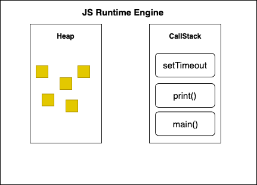
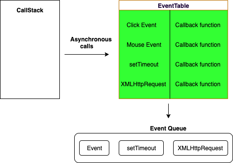

# Event Loop
The event loop is a process that continuously monitors both the **call stack** and the **event queue** and checks 
whether the call stack is empty or not. If the call stack is empty and there are pending events in the event queue, the 
event loop dequeues the event from the event queue and pushes it to the call stack. The call stack executes the event,
and any additional events generated during the execution are added to the end of the event queue.

Note: The event loop allows Node.js to perform non-blocking I/O operations, even though JavaScript is single-threaded,
by offloading operations to the system kernel whenever possible. Since most modern kernels are multithreaded, they can
handle multiple operations executing in the background.

## Tasks
A task is any javascript code/program which is scheduled to be run by the standard mechanisms such as initially starting
to run a program, run an `event callback`, or an `interval` or `timeout` being fired. All these tasks are scheduled on a
task queue. Below are the list of use cases to add tasks to the task queue,

* When a new javascript program is executed directly from console or running by the `<script>` element, the task will be
  added to the task queue.
* When an event fires, the event callback added to task queue
* When a `setTimeout` or `setInterval` is reached, the corresponding callback added to task queue

## Microtasks
Microtask is used for the javascript code which needs to be executed immediately after the currently executing 
task/microtask is completed. They are kind of blocking in nature. i.e, The main thread will be blocked until the
microtask queue is empty. The main sources of microtasks are `Promise.resolve`, `Promise.reject`, `MutationObservers`, 
`IntersectionObservers` etc

Note: All of these microtasks are processed in the same turn of the event loop.

### Microtask Queue
Microtask Queue is the new queue where all the tasks initiated by promise objects get processed before the callback 
queue. The microtasks queue are processed before the next rendering and painting jobs. But if these microtasks are 
running for a long time then it leads to visual degradation.

#### queueMicrotask
The queueMicrotask function is used to schedule a microtask, which is a function that will be executed asynchronously in 
the microtask queue. The purpose of queueMicrotask is to ensure that a function is executed after the current task has 
finished, but before the browser performs any rendering or handles user events.

```js
console.log("Start"); //1

queueMicrotask(() => {
  console.log("Inside microtask"); // 3
});

console.log("End"); //2
```
By using queueMicrotask, you can ensure that certain tasks or callbacks are executed at the earliest opportunity during 
the JavaScript event loop, making it useful for performing work that needs to be done asynchronously but with higher
priority than regular `setTimeout` or `setInterval` callbacks.


## Event Loop in Different Contexts
In JavaScript, there are multiple event loops that can be used depending on the context of your application. The most 
common event loops are:

### Browser Event Loop
The Browser Event Loop is used in client-side JavaScript applications and is responsible for handling events that occur
within the browser environment, such as user interactions (clicks, keypresses, etc.), HTTP requests, and other 
asynchronous actions.

### Node.js Event Loop
The Node.js Event Loop is used in server-side JavaScript applications and is responsible for handling events that occur
within the Node.js runtime environment, such as file I/O, network I/O, and other asynchronous actions.


# Call Stack
Call Stack is a data structure for javascript interpreters to keep track of function calls(creates execution context) 
in the program. It has two major actions,
* Whenever you call a function for its execution, you are pushing it to the stack.
* Whenever the execution is completed, the function is popped out of the stack.


# Event Queue
The event queue follows the queue data structure. It stores async callbacks to be added to the call stack. It is also
known as the Callback Queue or Macrotask Queue.

Whenever the call stack receives an async function, it is moved into the Web API. Based on the function, Web API 
executes it and awaits the result. Once it is finished, it moves the callback into the event queue (the callback of the 
promise is moved into the microtask queue).

The event loop constantly checks whether or not the call stack is empty. Once the call stack is empty and there is a 
callback in the event queue, the event loop moves the callback into the call stack. But if there is a callback in the
microtask queue as well, it is moved first. The microtask queue has a higher priority than the event queue.


# Heap
Heap(Or memory heap) is the memory location where objects are stored when we define variables. i.e, This is the place 
where all the memory allocations and de-allocation take place. Both heap and call-stack are two containers of JS runtime.
Whenever runtime comes across variables and function declarations in the code it stores them in the Heap.



# Event Table
Event Table is a data structure that stores and keeps track of all the events which will be executed asynchronously like
after some time interval or after the resolution of some API requests. i.e Whenever you call a setTimeout function or 
invoke async operation, it is added to the Event Table. It doesn't not execute functions on it’s own. The main purpose
of the event table is to keep track of events and send them to the Event Queue as shown in the below diagram.



Sources:
* [javascript-interview-questions](https://github.com/sudheerj/javascript-interview-questions)