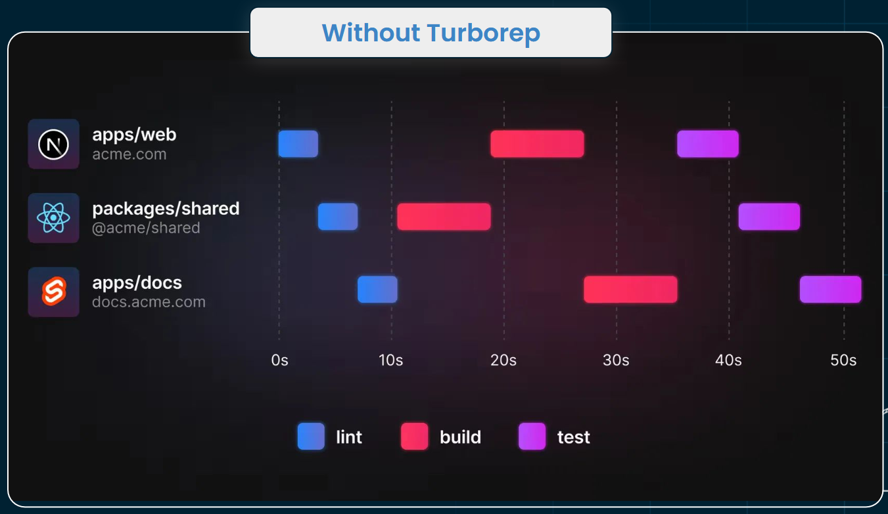
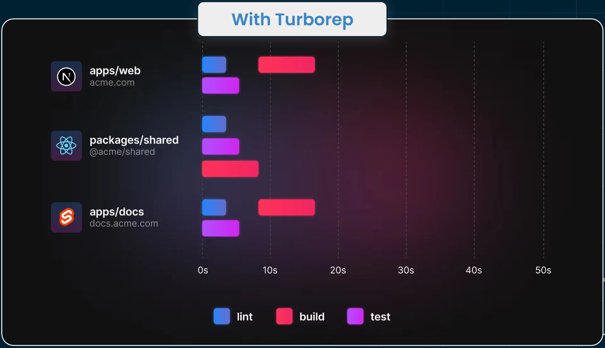
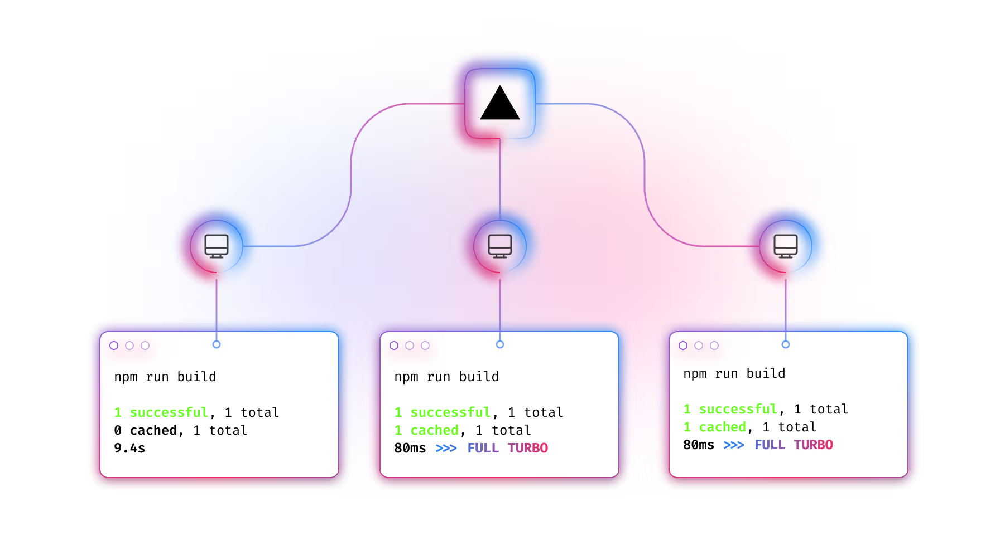

This note is based on the workshop from stack learners - [Efficient Monorepos for Enterprise Projects](https://www.stacklearner.com/my/workshops/efficient-monorepos-for-enterprise-projects)

# Turborepo

Turborepo is a high-performance build system designed to manage JavaScript and TypeScript monorepos efficiently. It 
optimizes workflows by leveraging smart caching, parallel execution, and dependency tracking to minimize redundant tasks
and accelerate development processes

## Turborepo Over Nx, or Lerna

Every monorepo tool has its own philosophy and structure. In recent years, we've seen significant discussions about 
popular monorepo tools like Nx, Lerna, and Turborepo.

Turborepo stands out over Lerna due to its simplicity. It provides the essential features that developers truly need, 
while more feature-rich tools like Nx can complicate the development process. Although Nx is a strong tool in its own 
right, its complex configuration can be daunting compared to Turborepo. With Turborepo, you can get started in just 3-5 
minutes, making it an excellent choice for developers looking for an efficient setup.


## Turborepo Features
Here are some features for those it is now popular to the developer community

### Remote Caching and Speed Optimization:
Turborepo provides integrated remote caching, enabling teams to share build artifacts across different environments
(e.g., local machines and CI). This significantly reduces build and test times across the team, especially for large 
projects.
### Incremental Builds:
Turborepo only rebuilds what has changed in the project, offering fast incremental builds. This ensures that even in 
large monorepos, unnecessary tasks are not re-run, optimizing the development workflow.
### Minimal Configuration:
Turborepo has a simplified setup process, making it easy to get started with minimal configuration. This is particularly
useful for teams that want to avoid the steeper learning curve of tools like Nx.
### Cross-Language Support:
While Nx primarily targets JavaScript and TypeScript projects, Turborepo can support polyglot monorepos, including 
projects written in Python, Go, Rust, and more, by leveraging its flexible build system.
### Native Support by Vercel:
As a Vercel product, Turborepo integrates seamlessly with the Vercel platform, offering native support for serverless 
and edge functions, which is beneficial for teams building modern web applications.


## Turborepo Architecture
Turborepo is a high-performance build system designed to manage JavaScript and TypeScript monorepos efficiently. Its 
architecture comprises several key components that work together to optimize the development workflow:

### Workspaces:
Turborepo leverages the workspace feature of package managers like npm, Yarn, or pnpm to group multiple packages within 
a single repository. This structure allows for organized management of applications and libraries, facilitating code 
sharing and dependency management.
### Task Management:
Developers define tasks (e.g., build, test, lint) in a turbo.json configuration file. Turborepo analyzes these tasks, 
understands their dependencies, and schedules them for execution in an optimal order. This ensures that tasks run
efficiently, respecting their interdependencies.
### Caching Mechanism:
Turborepo implements a robust caching system that stores the results of tasks. When a task is rerun without changes to 
its inputs, Turborepo retrieves the result from the cache instead of executing the task again. This significantly 
reduces redundant work and speeds up the development process.
### Remote Caching:
Beyond local caching, Turborepo offers remote caching capabilities through integration with platforms like Vercel. This
feature allows teams to share cached build artifacts across different environments, ensuring that once a task is 
completed by one team member, others can benefit from the cached results, further enhancing efficiency.
### Parallel Execution:
Turborepo is designed to utilize all available CPU cores by running tasks in parallel whenever possible. This
parallelism accelerates the execution of multiple tasks, making full use of system resources to improve build times.




Source: [Efficient Monorepos for Enterprise Projects](https://www.stacklearner.com/my/workshops/efficient-monorepos-for-enterprise-projects)

### Dependency Graph Analysis:
Turborepo constructs a dependency graph of the packages and tasks within the monorepo. This graph helps in determining
the order of task execution and identifying which packages need rebuilding when changes occur, ensuring that only the 
necessary parts of the codebase are processed.


## Task Configuration

Configuring tasks in Turborepo involves setting up your turbo.json file to define how tasks run, their dependencies, and 
caching behavior.

Without Turborepo The task look like below when you run your task:


Source: [Efficient Monorepos for Enterprise Projects](https://www.stacklearner.com/my/workshops/efficient-monorepos-for-enterprise-projects)

With Turborepo, your tasks look as follows: it effectively utilizes all the threads of your system, enhancing overall efficiency.


Source: [Efficient Monorepos for Enterprise Projects](https://www.stacklearner.com/my/workshops/efficient-monorepos-for-enterprise-projects)

### When and how to use various configurations:

### Defining Tasks

* **Purpose:** Specify tasks that Turborepo should manage.
* **How to Use:** In your `turbo.json`, under the `tasks` object, define each task corresponding to scripts in your 
`package.json`.

```json
{
  "tasks": {
    "build": {},
    "test": {}
  }
}
```

### Managing Task Dependencies with `dependsOn`

* Purpose: Ensure tasks run in the correct order, especially when one task relies on the output of another.
* How to Use:
  * Cross-Package Dependencies: Use "^taskName" to indicate that a task in dependent packages should run first.
    ```json
    {
      "tasks": {
        "build": {
          "dependsOn": ["^build"]
        }
      }
    }
    ```
* Same-Package Dependencies: List the task name without `^` to run tasks sequentially within the same package.
    ```json
    {
      "tasks": {
        "test": {
          "dependsOn": ["build"]
        }
      }
    }
    ```

### Specifying Outputs for Caching

* Purpose: Define which files or directories should be cached to avoid redundant work.
* How to Use: In each task, specify the outputs key with paths to cache.
```json
{
  "tasks": {
    "build": {
      "outputs": ["dist/**"]
    }
  }
}
```

### Defining Inputs for Task Hashing

* Purpose: Specify which files influence the task's cache, so changes to these files invalidate the cache.
* How to Use: Use the `inputs` key to list relevant files or patterns.
```json
{
  "tasks": {
    "spell-check": {
      "inputs": ["**/*.md"]
    }
  }
}
```

### Creating Root-Level Tasks

* Purpose: Define tasks that operate at the repository root, not tied to a specific package.
* How to Use: Prefix the task name with //# in turbo.json.
```json
{
  "tasks": {
    "//#lint:root": {}
  }
}
```

### Handling Non-Cached Tasks

* Purpose: Ensure certain tasks, like deployments, run every time regardless of caching.
* How to Use: `Set "cache"`: false for these tasks.
```json
{
  "tasks": {
    "deploy": {
      "dependsOn": ["^build"],
      "cache": false}
  }
}
```

### Running Tasks in Parallel with Transit Nodes

* Purpose: Optimize task execution by allowing parallel runs while maintaining correct dependency order.
* How to Use: Introduce intermediary tasks (transit nodes) to manage dependencies.
```json
{
  "tasks": {
    "transit": {
      "dependsOn": ["^transit"]
    },
    "check-types": {
      "dependsOn": ["transit"]
    }
  }
}
```

# Turborepo Caching

Turborepo caches the outputs of tasks such as builds, tests, and linting to avoid redundant work and speed up subsequent runs.



Source: [Efficient Monorepos for Enterprise Projects](https://www.stacklearner.com/my/workshops/efficient-monorepos-for-enterprise-projects)

### How Turborepo Determines What to Cache

Turborepo uses a hashing algorithm to create unique identifiers (hashes) for each task based on its inputs, including
source files, configuration, and environment variables. When a task runs, Turborepo computes its hash and checks if a 
matching cache entry exists:

* **Cache Hit**: If a matching hash is found, Turborepo retrieves the cached outputs, avoiding the need to rerun the task.
* **Cache Miss**: If no matching hash is found, the task executes, and its outputs are cached for future use.

### Default Cached Data

By default, Turborepo caches task outputs specified in the outputs key of the turbo.json configuration file. This 
typically includes directories like dist/ for builds or other output folders generated by tasks. If the outputs key is
not specified, Turborepo may not cache the task's outputs.

### Storage Location of Cach**ed Data

* Local Cache: Cached data is stored locally on your machine, typically within the .turbo/cache directory.
* Remote Cache: For team environments, Turborepo supports remote caching, allowing cached data to be stored on a shared
  server. This enables team members to share build artifacts, reducing redundant computations across different machines.

### Enabling Remote Cache

To enable remote caching with Vercel's Remote Cache:

* **Authenticate**: Run pnpm turbo login to authenticate with your Remote Cache provider.
* **Link Repository**: Run pnpm turbo link to link your repository to the Remote Cache.

After these steps, Turborepo will automatically use the remote cache for storing and retrieving task outputs.

### Benefits of Turborepo's Caching System

* **Increased Efficiency**: By caching task outputs, Turborepo reduces redundant work, leading to faster build times.
* **Team Collaboration**: Remote caching allows team members to share cached artifacts, ensuring consistency and saving time 
  across the development team.
* **Optimized CI Pipelines**: With caching, continuous integration systems can skip redundant tasks, resulting in quicker 
  feedback loops.

# Turborepo with Github workflow

Integrating Turborepo with GitHub Actions can significantly enhance your continuous integration workflows by leveraging
caching mechanisms to speed up builds and tests. Here's how you can set it up:

## Setting Up a GitHub Actions Workflow for Turborepo

Create a `.github/workflows/ci.yml` file in your repository with the following content:

```yaml
name: CI

on:
  push:
    branches:
      - main
  pull_request:
    branches:
      - main

jobs:
  build:
    name: Build and Test
    runs-on: ubuntu-latest

    steps:
      - name: Check out code
        uses: actions/checkout@v4
        with:
          fetch-depth: 2

      - name: Set up Node.js
        uses: actions/setup-node@v4
        with:
          node-version: 20
          cache: 'npm'

      - name: Install dependencies
        run: npm install

      - name: Build
        run: npm run build

      - name: Test
        run: npm run test
```

### Enabling Remote Caching with Vercel

Turborepo supports remote caching, allowing you to share build caches across different environments. To enable this:

* Create a Vercel Account: If you don't have one

* Generate a Scoped Access Token: In your Vercel dashboard, navigate to Access Tokens and create a new token.

* Add Secrets to GitHub: In your GitHub repository:
   *  Go to Settings > Secrets and variables > Actions.
   *  Add a new secret named TURBO_TOKEN with the value of your Vercel access token.
   *  Add a repository variable named TURBO_TEAM with your Vercel team or username.
* Update Workflow for Remote Caching: Modify your workflow to include the necessary environment variables:
```yaml
jobs:
  build:
    name: Build and Test
    runs-on: ubuntu-latest
    env:
      TURBO_TOKEN: ${{ secrets.TURBO_TOKEN }}
      TURBO_TEAM: ${{ vars.TURBO_TEAM }}
      TURBO_REMOTE_ONLY: true

    steps:
```


## Containerization challenge of the monorepo.

Most developers complain that with a monorepo, they cannot build an optimized Docker image. Unnecessary files and code
make the image inefficient. Here are some challenges we encounter when discussing the creation of Docker images for a 
package within a monorepo:

* **Dependency Management**: Ensuring each service or application within the monorepo has access to only its required 
  dependencies without unnecessary bloat.
* **Build Optimization**: Avoiding redundant builds and leveraging caching mechanisms to reduce build times.
* **Image Size Minimization**: Creating Docker images that are as small as possible by including only necessary files and
  dependencies.

### Turborepo's Solutions:

* **Pruning Unnecessary Files with turbo prune**: Turborepo's turbo prune command helps create a minimized version of your
  monorepo, including only the essential packages and dependencies for a specific application. This is particularly 
  useful for Docker builds, as it reduces the context size and ensures that only relevant files are included. For 
  example, running turbo prune --scope=web --docker generates a pruned directory tailored for the 'web' application.
* **Optimized Multi-Stage Docker Builds**: By combining Turborepo with multi-stage Docker builds, you can efficiently build 
  and package your applications. In the build stage, you can install dependencies and compile the application, and in 
  the final stage, you can copy only the necessary build artifacts into the runtime image. This approach minimizes the
  final image size and enhances security by excluding development tools and source code.
* **Leveraging Remote Caching**: Turborepo's remote caching stores the results of your tasks, ensuring that repeated builds, 
  especially in CI environments, are faster and more efficient. This caching mechanism prevents redundant work and
  accelerates the build process across different environments.


```shell
pnpm install turbo --global
pnpm dlx create-turbo@latest
turbo run build --graph=my-graph.png
pnpm turbo gen init
pnpm install axios --filter=@repo/web
turbo login
turbo link
npx turbo unlink
turbo prune --scope=@repo/express-app --docker
```

# Resources
- [Efficient Monorepos for Enterprise Projects](https://www.stacklearner.com/my/workshops/efficient-monorepos-for-enterprise-projects)
