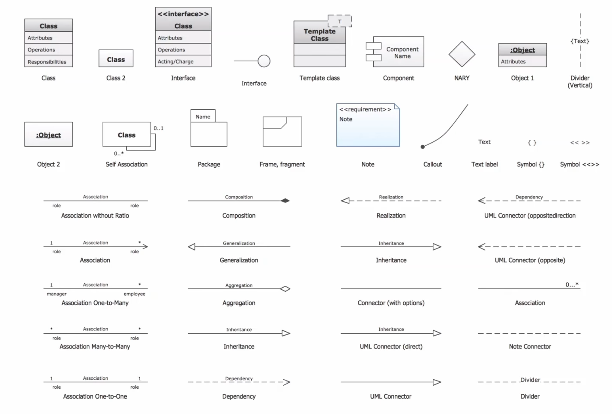
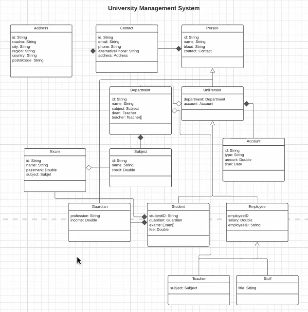
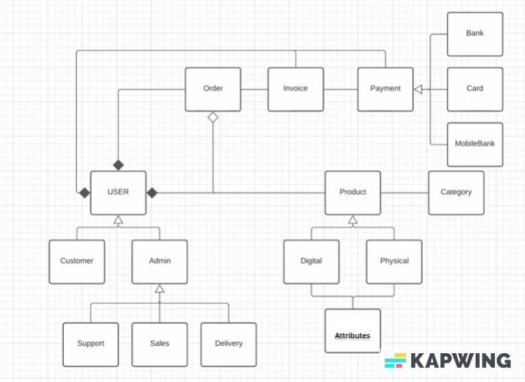

## Procedural Programming vs Object-Oriented Programming

Before OOP programmers uses procedural programming. In procedural programming we write code in a sequence. 
 
```cpp
String name = "HM Nayem";
String email = "hmnayem@example.com";
String password = "xsdft123$2^1";
String username = "hmnayem";

User createUser(/* data */) {};
void login(/* data */) {};
void logout() {};
void resetPassword(/* data */) {};

String name2 = "HM Nayem";
String email2 = "hmnayem@example.com";
String password2 = "xsdft123$2^1";
String username2 = "hmnayem";
```

The key difference between object-oriented programming (OOP) and procedural programming is: <br/>
OOP focuses on creating objects that contain both data and the functions/methods that manipulate that data. Objects 
interact with one another through well-defined interfaces.

Procedural programming is centered around writing a list of instructions (procedures) that the computer must follow
step-by-step to achieve a desired result. It emphasizes the sequence of execution rather than the organization of data 
and functionality.

**In summary:** <br/>
OOP: Data and functions are encapsulated in objects <br/>
Procedural: Emphasis is on ordered execution of procedures/functions <br/>


## Why Struct > Procedural
Struct Advantages:

* Encapsulation
* Organization
* Reuse
* Extensibility
* Type Safety

```cpp
String name = "HM Nayem"; 
String email = "hmnayem@example.com";
String password = "xsdft123$2^1";
String username = "hmnayem";

Struct user1 = {/* data */};
Struct user2 = {/* data */};
Struct user3 = {/* data */};
Struct user4 = {/* data */};

login(Struct user1);
login(Struct user2);
login(Struct user3);
login(Struct user4);
```

Struct offers structured, reusable data/functionality.

## Disadvantages of Procedural Programming
Procedural Programming is good, but there are some serious issues we face when creating software for the real world. 
Mapping real world objects and data to programming constructs is challenging with a procedural approach like C.

* Code is not reusable
* Large code base is hard to manage
* Difficult to tracing and fixing bugs
* Data is exposed to whole program
* Here, operation's priority is higher that data
* Difficult to relate with real world data


# OOP

Class which is a template to create objects. Objects are instances of a class. Objects have properties and methods.
```cpp
class User {
    String name;                // attributes or properties -> sometime called as state
    String email;               // attributes or properties
    String password;            // attributes or properties
    String username;            // attributes or properties

    User(/* data */) {};        // constructor
    void login() {};            // functions or in terms of oop it called as methods
    void logout() {};           // functions or in terms of oop it called as methods
    void resetPassword() {};    // functions or in terms of oop it called as methods
};

User user1 = new User(/* data */);
```

**OOP is all about object. Class is a template to create multiple object.**

## Class
Class is a blueprint for creating objects. It defines a data structure that includes data members (fields) and
functions (methods).

* Properties, attributes -> Properties
  * Public
  * Private -> most of the properties are private
  * static
  * readonly
* Methods, functions -> Methods
  * Public
  * Private
  * Protected
  * Static


## Object
Anything that needs multiple attributes or multiple primitives to define. Object is king in Object Orientation 
Programming.

* Properties, attributes -> Properties
* Methods, functions -> Methods

## What is an object?
* Combination of Noun, Adjective and verb.
  * Noun/Adjective -> Properties
    * Suppose for cat object
      * Noun -> Name, Color, Age
      * Adjective -> Playful, Lazy 
      * Verb -> Methods
        * Eat, Sleep, Play
    * Suppose for car object
      * Noun -> Brand, Model, Color
      * Adjective -> Family, Sports
      * Verb -> Methods
        * Start, Stop, Accelerate
* A capsule that can encapsulate data and operations(methods) on that data.
* Has some private and public properties
* Has some private and public methods
* Is a custom data type
  * When we create a object with `new` keyword we create a custom data type.
* An isolated environment for properties and methods.

Whatever you can see near beside you is an object. Finding object, it's properties and methods are the main mechanism
of learning object-oriented programming.


## Four Main Pillars of OOP
To implement these topics properly we will need some additional features and techniques too which are language specific
and not all languages has same ability to implement object-oriented programming properly.


# Abstraction
Abstraction means hiding the implementation details inside and providing just the necessary api. We never know how it is
working, we only know what to do.


# Encapsulation
The definition of encapsulation is "the action of enclosing something in or as if in a capsule". Encapsulation means 
that each object in your code should control its own state. State is the current "snapshot" of your object.


# Inheritance
The ability of creating a new class from an existing class. Inheritance is when an object acquires the property of 
another object. Inheritance allows a class to acquire the properties and behavior of another class.

```
+-------------------+                     +-------------------+                     +-------------------+
|      PERSON       |                     |     STUDENT       |                     |      TEACHER      |
+-------------------+                     +-------------------+                     +-------------------+
| Id: int           |                     | Id: int           |                     | Id: int           |
| Name: String      |                     | Name: String      |                     | Name: String      |
| Email: String     |                     | Email: String     |                     | Email: String     |
| Password: String  |                     | Password: String  |                     | Password: String  |
|                   |                     | Subjects: String[]|                     | Subject: String   |
|                   |                     | Fee: Double       |                     | Salary: Double    |
+-------------------+                     +-------------------+                     +-------------------+
| createUser()      |                     | createUser()      |                     | createUser()      |
| forgotPassword()  |                     | forgotPassword()  |                     | forgotPassword()  |
|                   |                     | result()          |                     | takeClass()       |
+-------------------+                     +-------------------+                     +-------------------+
```
Now we can remove common properties `Id, Name, Email, Password` and methods `createUser(), forgotPassword()` from
`Student` and `Teacher` class and put them in `Person` class. So, `Student` and `Teacher` class will inherit from
`Person` class.

```shell
              +--------------------+
              |      PERSON        |
              +--------------------+
              | Id: int            |
              | Name: String       |
              | Email: String      |
              | Password: String   |
              +--------------------+
              | createUser()       |
              | forgotPassword()   |
              +--------------------+
                       |
                       |
                  INHERITANCE
                 ↙          ↘
+--------------------+     +--------------------+
|      STUDENT       |     |      TEACHER       |
+--------------------+     +--------------------+
| Subjects: String[] |     | Subject: String    |
| Fee: Double        |     | Salary: Double     |
+--------------------+     +--------------------+
| result()           |     | takeClass()        |
+--------------------+     +--------------------+
```

Is a relationship is implemented by inheritance. `Student` is a `Person`. `Teacher` is a `Person`. So, `Student` and
`Teacher` class is inheriting from `Person` class.

**Another Example:**
```shell
          +-------------+
          |   Person    |
          +-------------+
           /    |    \
          ↙     ↓     ↘
 +---------+  +---------+   +----------+
 | Student |  | Guardian |   | Employee |
 +---------+  +---------+   +----------+
                             /       \
                            ↙         ↘
                    +---------+   +---------+
                    | Teacher |   |  Staff  |
                    +---------+   +---------+
```

`Teacher` is a `Employee`. `Staff` is a `Employee`. `Employee` is a `Person`. `Student` is a `Person`. `Guardian` is a
`Person`. So, `Teacher`, `Staff`, `Student` and `Guardian` class is inheriting from `Person` class.


# Polymorphism
Polymorphism is derived from 2 greek words: poly and morphs. The word "poly" means many and "morphs" means forms. So
polymorphism means "many forms".

##  Compile Time Polymorphism
### Constructor Overloading
Java, C++ and C# support constructor overloading. Constructor overloading is a concept of having more than one 
constructor with different parameters list, in such a way so that each constructor performs a different task.

```java
class Student {
    String name;
    int id;
    Student() {
        name = "Unknown";
        id = 0;
    }
    Student(String n, int i) {
        name = n;
        id = i;
    }
}
```

### Operator Overloading
In C++ we can overload operators. For example, we can overload `+` operator to add two objects of a class.

```cpp
#include <iostream>
using namespace std;

class Number {
    int value;

public:
    Number(int v = 0) : value(v) {}

    // Overload + operator
    Number operator+(const Number &obj) {
        return Number(value + obj.value);
    }

    // Display the value with a specific message
    void display(const string& label) const {
        cout << label << ": " << value << endl;
    }
};

int main() {
    Number n1(10), n2(20);
    
    // Displaying n1 with a specific label
    n1.display("n1 contains");  // Displays: n1 contains: 10

    // Displaying n2 with a specific label
    n2.display("n2 contains");  // Displays: n2 contains: 20

    // Adding n1 and n2 using overloaded + operator
    Number n3 = n1 + n2;

    // Displaying n3 with a specific label
    n3.display("n3 (n1 + n2) contains");  // Displays: n3 (n1 + n2) contains: 30

    return 0;
}

```

### Function Overloading
Function overloading is a feature that allows us to have more than one function with the same name, but with different
parameters. Function overloading can be considered as an example of polymorphism feature in C++.

```cpp
class Addition {
    public:
        int add(int a, int b) {
            return a + b;
        }
        int add(int a, int b, int c) {
            return a + b + c;
        }
        int add(int a, int b, int c, int d) {
            return a + b + c + d;
        }
}
```

### Function Overriding
Function overriding is a feature that allows us to have a same function in child class which is already present in the
parent class. When we define a function in the child class with the same name and signature as a function in the parent
class, the process is known as function overriding.

```cpp
class Animal {
    public:
        void sound() {
            cout << "Animal makes a sound" << endl;
        }
};

class Dog : public Animal {
    public:
        void sound() {
            cout << "Dog barks" << endl;
        }
};

class Cat : public Animal {
    public:
        void sound() {
            cout << "Cat meows" << endl;
        }
};
```

## Run Time Polymorphism
### Virtual Function
Run Time Polymorphism allows a program to decide at runtime which method (function) to call, based on the actual object
type (not the pointer/reference type).

A virtual function is a function in the base class that can be overridden in a derived class. When you call a virtual 
function through a base class pointer or reference, the function of the derived class is executed, not the one in the b
ase class.

```cpp
class Animal {
    public:
        virtual void sound() {
            cout << "Animal makes a sound" << endl;
        }
};

class Dog : public Animal {
    public:
        void sound() {
            cout << "Dog barks" << endl;
        }
};

class Cat : public Animal {
    public:
        void sound() {
            cout << "Cat meows" << endl;
        }
};

int main() {
    Animal *animal;
    Dog dog;
    Cat cat;

    animal = &dog;
    animal->sound();  // Output: Dog barks

    animal = &cat;
    animal->sound();  // Output: Cat meows

    return 0;
}
```


## Two types of relationships in OOP
### IS A Relationship
* Inheritance


### HAS A Relationship
* Composition
* Aggregation

In this example below `Student` class has a `Department` object. So, `Student` class has a `Department` object.`Student` 
is not a `Department` or `Department` is not a `Student`. They are related by HAS A relationship. 
```shell
                                   
                                   HAS A Relationship
                                   
+------------------------+       +-----------------------+      +-----------------------+     
|      STUDENT           |       |      Department       |      |     Subjects          |
+------------------------+       +-----------------------+      +-----------------------+
| department: Department |       | Subjects: String[]    |      |  name: String         |
|                        |       |                       |      |                       |
+------------------------+       +-----------------------+      +-----------------------+
| /* methods */          |       | /* methods */         |      | /* methods */         |
+------------------------+       +-----------------------+      +-----------------------+
       ↑                                ↑      ↑                          ↑
       |---------------------------------      ----------------------------------|
                    aggregation                              composition         
```

#### Aggregation
Aggregation is a special form of association. It is a relationship between two classes like association, however its a
more specific form of association. It is a whole/part relationship. In aggregation, the part can exist independently of
the whole. Aggregation is a weak association.

Suppose in the example of `Student` and `Department` class, `Department` class can exist independently of `Student`
class so if we delete all `Student` object then `Department` object will still exist. So, it is an aggregation.

#### Composition
Composition is a special form of aggregation. It is a strong association. It is a whole/part relationship. In 
composition, the part cannot exist independently of the whole. If the whole is deleted, then all parts are deleted.

Suppose in the example of `Department` and `Subjects` class, Each `Department` of any university has some subjects. If
university close / off a department then all subjects of that department will also be closed. So, the existence of 
subjects is dependent on the existence of the department. So, it is a composition.

## Association
Association is a relationship between two classes. It is a more general form of relationship. It is a weak relationship
between two classes. It is a simple relationship between two classes. It can be one-to-one, one-to-many, many-to-one or
many-to-many.

# UML Diagram



Source: [JavaScript OOP Simplified - Master the Basics and Build a Real-World Project | Stack Learner](https://www.youtube.com/watch?v=B6vSq4KiZeM)


# OOP Case Studies

## University Management System

### Client Requirements:
Build a University Management System where admin can manage students, guardians, teachers, staff, departments, subjects,
exams and accounts.

Admin can create, update, delete and manage all the resources.

### Breakdown The Requirements:
Objects

* Person
* Student
* Guardian
* Teacher
* Staff
* Department
* Subjects
* Exam
* Account

#### Object property list

**Student**
* id
* name
* guardian
* contact
* blood
* account
* exams
* department

**Guardian**
* id
* name
* contact
* blood
* profession
* income

**Teacher**
* id
* name
* contact
* blood
* department
* subject 
* salary

**Staff**
* id
* name
* contact
* blood
* department
* title
* salary

**Contact**
* id
* email
* phone
* alternative phone
* address

**Address**
* id
* road no
* city
* region
* country
* postalCode

**Department**
* id 
* name
* subjects
* dean(Teacher)
* teachers

**Subject**
* id
* name
* credit
* department

**Exam**
* id
* name
* passMark
* duration
* subject
* students

**Accounts**
* id
* type
* amount
* time


**UML Diagram**

Does not include methods for simplicity.



Source: [JavaScript OOP Simplified - Master the Basics and Build a Real-World Project | Stack Learner](https://www.youtube.com/watch?v=B6vSq4KiZeM)


## E-commerce System

Does not include properties and functions for simplicity.

This is single vendor e-commerce system. Both customer and admin is a user so they will be inheritance from user. We 
have three types admin like support, sales, delivery, and they are is an admin so they will be inheritance from admin.

We have production and category has simple relationship with product so it is an association. To make a product we need
a category and using a category we can get all products of that category, also from product we can get the category of
that product.

We can have different types of production like digital and physical product. Both of them are a product so they will be
inheritance from product. Both of them have attributes like size, weight, color, etc. From product, we can get attributes
and from attributes we can get the products(by filtering color, size etc.) so they have association relationship.

Order, product and user have a relationship. Order and user has composition relationship because if we delete a user
then we will not need the order of that user. Order and product has aggregation relationship as if a user delete a 
product from its order then the product will still exist.

Invoice and order has association relationship. Invoice and order has composition relationship as if we delete an order
then the invoice for that order will also be deleted. Payment has association relationship with invoice. We have bank,
card, mobile banking for payment they are inheritance from payment as they have is a relationship. Additionally, 
invoice and payment has composition relationship as if we delete user then the invoice and payment for that user will
also be deleted as without user they are not needed.




Source: [JavaScript OOP Simplified - Master the Basics and Build a Real-World Project | Stack Learner](https://www.youtube.com/watch?v=B6vSq4KiZeM)


# Reference
* [JavaScript OOP Simplified - Master the Basics and Build a Real-World Project | Stack Learner](https://www.youtube.com/watch?v=B6vSq4KiZeM)